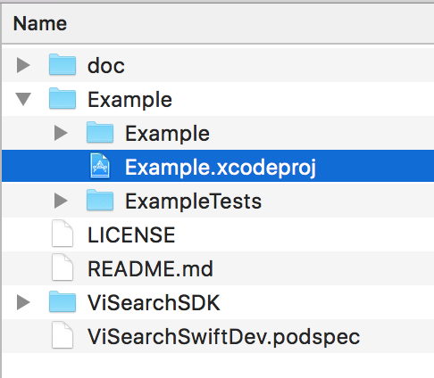
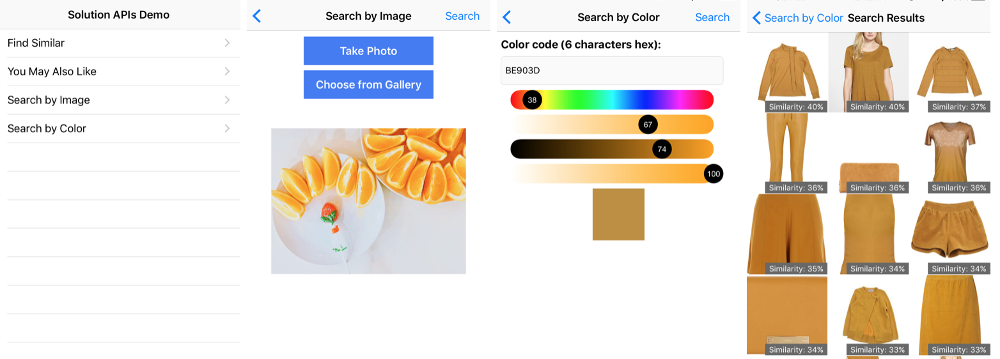
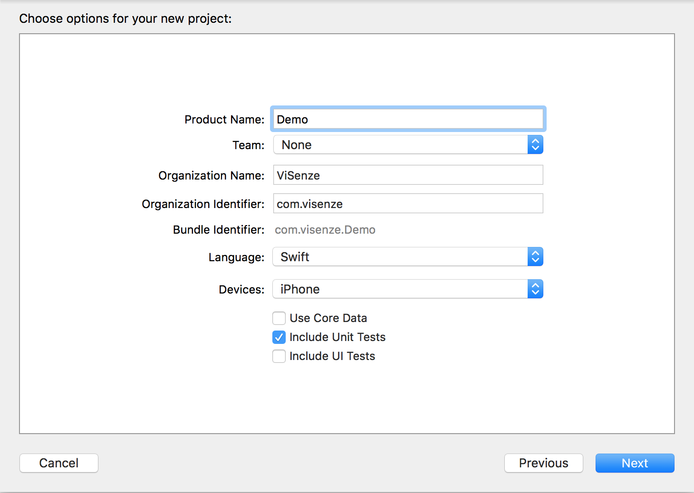
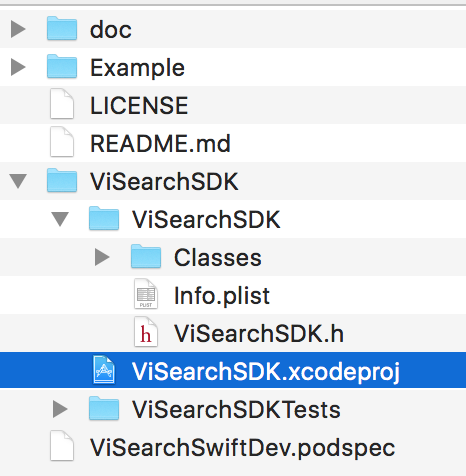

# ViSearch Swift SDK and Demo Source Code


---

##Table of Contents
 1. [Overview](#1-overview)
 2. [Setup](#2-setup)
      - 2.1 [Run the Demo](#21-run-the-demo)
      - 2.2 [Set up Xcode Project](#22-set-up-xcode-project)
      - 2.3 [Import ViSearch Swift SDK](##23-import-visearch-swift-sdk)
      - 2.4 [Add Privacy Usage Description](#24-add-privacy-usage-description)
 3. [Initialization](#3-initialization)
 4. [Solutions](#4-solutions)
    - 4.1 [Find Similar](#41-find-similar)
    - 4.2 [You May Also Like](#42-you-may-also-like)
    - 4.3 [Search by Image](#43-search-by-image)
	    - 4.3.1 [Selection Box](#431-selection-box)
	    - 4.3.2 [Resizing Settings](#432-resizing-settings)
    - 4.4 [Search by Color](#44-search-by-color)
 5. [Search Results](#5-search-results)
 6. [Advanced Search Parameters](#6-advanced-search-parameters)
	  - 6.1 [Retrieving Metadata](#61-retrieving-metadata)
	  - 6.2 [Filtering Results](#62-filtering-results)
	  - 6.3 [Result Score](#63-result-score)
	  - 6.4 [Automatic Object Recognition Beta](#64-automatic-object-recognition-beta)
 7. [Event Tracking](#7-event-tracking)

---


## 1. Overview

ViSearch is an API that provides accurate, reliable and scalable image search. ViSearch API provides two services (Data API and Search API) to let the developers prepare image database and perform image searches efficiently. ViSearch API can be easily integrated into your web and mobile applications. For more details, see [ViSearch API Documentation](http://www.visenze.com/docs/overview/introduction).

The ViSearch iOS SDK is an open source software to provide easy integration of ViSearch Search API with your iOS applications. It provides four search methods based on the ViSearch Solution APIs - Find Similar, You May Also Like, Search By Image and Search By Color. For source code and references, please visit the [Github Repository](https://github.com/visenze/visearch-sdk-swift).

>Current stable version: 1.1.0

>Supported iOS version: iOS 8.x and higher


## 2. Setup

### 2.1 Run the Demo

The source code of a demo application is provided together with the SDK ([demo](https://github.com/visenze/visearch-sdk-swift/tree/master/Example)). You can simply open **Example** project in XCode and run the demo.



You should initialize the ViSearch client in AppDelegate file by using your app key or access/secret key pair.

```swift

// recommended way of init ViSearch client with app key
ViSearch.sharedInstance.setup(appKey: "YOUR_APP_KEY")

// old way of init ViSearch client with access and secret key pair
ViSearch.sharedInstance.setup(accessKey: "YOUR_ACCESS_KEY", secret: "YOUR_SECRET_KEY")
       
```

You can play around with our demo app to see how we build up the cool image search feature using ViSearch SDK.



### 2.2 Set up Xcode project

In Xcode, go to File > New > Project Select the Single View Application.


Type a name for your project and press Next, here we use Demo as the project name.



### 2.3 Import ViSearch Swift SDK

#### 2.3.1 Using CocoaPods

First you need to install the CocoaPods Ruby gem:

```
# Xcode 7 + 8
sudo gem install cocoapods --pre
```

Then go to your project directory to create an empty Podfile
```
cd /path/to/Demo
pod init
```

Edit the Podfile as follow:
```
platform :ios, '9.0'
use_frameworks!

target '<Your Target Name>' do
    pod 'ViSearchSDK', '~>1.1.0'
end
...
```

Install the ViSearch SDK:

```
pod install
```
The Demo.xcworkspace project should be created.

#### 2.3.2 Using Manual Approach

You can also download the iOS [ViSearch SDK](https://github.com/visenze/visearch-sdk-swift/archive/master.zip) directly. To use it, unzip it and drag ViSearchSDK project into Demo project.



- Open the `ViSearchSDK` folder, and drag the `ViSearchSDK.xcodeproj` into the Project Navigator of your application's Xcode project.

    > It should appear nested underneath your application's blue project icon. Whether it is above or below all the other Xcode groups does not matter.

    

- Select the `ViSearchSDK.xcodeproj` in the Project Navigator and verify the deployment target matches that of your application target.
- Next, select your application project in the Project Navigator (blue project icon) to navigate to the target configuration window and select the application target under the "Targets" heading in the sidebar.
- In the tab bar at the top of that window, open the "General" panel.
- Click on the `+` button under the "Embedded Binaries" section.
- Select the `ViSearchSDK.framework`.

> The `ViSearchSDK.framework` is automagically added as a target dependency, linked framework and embedded framework.

You are done!

### 2.4 Add Privacy Usage Description

iOS 10 now requires user permission to access camera and photo library. If your app requires these access, please add description for NSCameraUsageDescription, NSPhotoLibraryUsageDescription in the Info.plist. More details can be found [here](https://developer.apple.com/library/content/documentation/General/Reference/InfoPlistKeyReference/Articles/CocoaKeys.html#//apple_ref/doc/uid/TP40009251-SW24).

## 3. Initialization
`ViSearch` **must** be initialized with an `appKey` or `accessKey`/`secretKey` pair **before** it can be used.

```swift
import ViSearchSDK
...
// using default ViSearch client. The client, by default, will connect to Visenze's server

// recommended way of init ViSearch client with app key
ViSearch.sharedInstance.setup(appKey: "YOUR_APP_KEY")

// old way of init ViSearch client with access and secret key pair
ViSearch.sharedInstance.setup(accessKey: "YOUR_ACCESS_KEY", secret: "YOUR_SECRET_KEY")

...
// or using customized client, which connects to your own server
client = ViSearchClient(baseUrl: yourUrl, accessKey: accessKey, secret: secret)
...
```

By default, API search requests will timeout after 10s. To change the timeout, you can configure the client as below:

```swift
            
// configure timeout to 30s example. By default timeout is set 10s.
ViSearch.sharedInstance.client?.timeoutInterval = 30
ViSearch.sharedInstance.client?.sessionConfig.timeoutIntervalForRequest = 30
ViSearch.sharedInstance.client?.sessionConfig.timeoutIntervalForResource = 30
ViSearch.sharedInstance.client?.session = URLSession(configuration: (ViSearch.sharedInstance.client?.sessionConfig)!)
    
```


## 4. Solutions

### 4.1 Find Similar
**Find similar** solution is used to search for visually similar images in the image database giving an indexed image’s unique identifier (im_name).

```swift
import ViSearchSDK

...
let params = ViSearchParams(imName: "imName-example")
ViSearch.sharedInstance.findSimilar( params: params!,
                    successHandler: {
                        (data : ViResponseData?) -> Void in
                            // Do something when request succeeds
                            // preview by calling : dump(data)
                            // check ViResponseData.hasError and ViResponseData.error for any errors return by ViSenze server
                    },
                   failureHandler: {
                        (err) -> Void in
                        // Do something when request fails e.g. due to network error
                        print ("error: \\(err.localizedDescription)")
                    })

...
```

### 4.2 You May Also Like
**You may also like** solution is used to provide a list of recommended items from the indexed image database based on customizable rules giving an indexed image’s unique identifier (im_name).

```swift
import ViSearchSDK
...

let params = ViSearchParams(imName: "imName-example")
ViSearch.sharedInstance.recommendation( params: params!,
                    successHandler: {
                        (data : ViResponseData?) -> Void in
                            // Do something when request succeeds
                            // preview by calling : dump(data)
                            // check ViResponseData.hasError and ViResponseData.error for any errors return by ViSenze server
                    },
                   failureHandler: {
                        (err) -> Void in
                        // Do something when request fails e.g. due to network error
                        print ("error: \\(err.localizedDescription)")
                    })
...
```

### 4.3 Search by Image
**Search by image** solution is used to search similar images by uploading an image or providing an image url. You should construct the `UIImage` object and pass it to `ViUploadSearchParams` to start a search.

* Using  Image

```swift
import ViSearchSDK
...

let image = UIImage(named: "someImage.png")
let params = ViUploadSearchParams(image: image!)

ViSearch.sharedInstance.uploadSearch(params: params,
                    successHandler: {
                        (data : ViResponseData?) -> Void in
                        // Do something when request succeeds
                        // preview by calling : dump(data)
                        // check ViResponseData.hasError and ViResponseData.error for any errors return by ViSenze server
                    },
                    failureHandler: {
                        (err) -> Void in
                        // Do something when request fails e.g. due to network error
                        print ("error: \\(err.localizedDescription)")
					})

```

* Alternatively, you can pass an image url directly to `ViUploadSearchParams` to start the search :

```swift
import ViSearchSDK
...

let params = ViUploadSearchParams(im_url: "http://somesite.com/sample_image.png")
        
ViSearch.sharedInstance.uploadSearch(params: params!,
                    successHandler: {
                        (data : ViResponseData?) -> Void in
                        // Do something when request succeeds
                        // preview by calling : dump(data)
                        // check ViResponseData.hasError and ViResponseData.error for any errors return by ViSenze server
                    },
                    failureHandler: {
                        (err) -> Void in
                        // Do something when request fails e.g. due to network error
                        print ("error: \\(err.localizedDescription)")
                    })
...
```

* Once uploading an image, you will receive a im\_id attribute from the [Search Results](#5-search-results). If you want to search the same image again, you can save the bandwidth by specifying the im\_id in the params:

```swift
import ViSearchSDK
...

let params = ViUploadSearchParams(im_id: "im_id_example")
        
ViSearch.sharedInstance.uploadSearch(params: params!,
                    successHandler: {
                        (data : ViResponseData?) -> Void in
                        // Do something when request succeeds
                        // preview by calling : dump(data)
                        // check ViResponseData.hasError and ViResponseData.error for any errors return by ViSenze server
                    },
                    failureHandler: {
                        (err) -> Void in
                        // Do something when request fails e.g. due to network error
                        print ("error: \\(err.localizedDescription)")


...
```
#### 4.3.1 Selection Box
If the object you wish to search for takes up only a small portion of your image, or other irrelevant objects exists in the same image, chances are the search result could become inaccurate. Use the Box parameter to refine the search area of the image to improve accuracy. The box coordinated is set with respect to the original size of the uploading image. Note: the coordinate system uses pixel as unit instead of point.

```swift
// create the box to refine the area on the searching image
// ViBox(x1, y1, x2, y2) where (0,0) is the top-left corner
// of the image, (x1, y1) is the top-left corner of the box,
// and (x2, y2) is the bottom-right corner of the box.
...

let params = ViUploadSearchParams(.....)

let box = ViBox(x1: 0, y1: 0, x2: 100, y2: 100)
params!.box = box
        
// start searching
...
```

#### 4.3.2 Resizing Settings
When performing upload search, you may notice the increased search latency with increased image file size. This is due to the increased time spent in network transferring your images to the ViSearch server, and the increased time for processing larger image files in ViSearch.

To reduce upload search latency, by default the uploadSearch method makes a copy of your image file and resizes the copy to 512x512 pixels if one of the original dimensions exceed 512 pixels. This is the optimized size to lower search latency while not sacrificing search accuracy for general use cases:

```swift
// by default, the max width of the image is set to 512px, quality is 0.97
let params = ViUploadSearchParams(.....)

// or you can explicitly set a param's settings
params?.img_settings = ViImageSettings(setting: .highQualitySetting)
        
```

If your image contains fine details such as textile patterns and textures, you can use an image with larger size for search to get better search result:

```swift
// by default, the max width of the image is set to 512px, quality is 0.97
let params = ViUploadSearchParams(.....)

// set the image with high quality settings.
// Max width is 1024px, and the quality is 0.985. Note: Quality with 1.0 take hugespace
params?.img_settings = ViImageSettings(setting: .highQualitySetting)

```

Or, provide the customized resize settings. To make efficient use the of the memory and network bandwidth of mobile device, the maximum size is set at 1024 x 1024. Any image exceeds the limit will be resized to the limit:

```swift
//resize the image to 800 by 800 area using jpeg 0.9 quality
params?.img_settings = ViImageSettings(size: CGSize(width: 800, height: 800), quality: 0.9)
        
```

### 4.4 Search by Color
**Search by color** solution is used to search images with similar color by providing a color code. The color code should be in **Hexadecimal** and passed to `ViColorSearchParams` as a `String`.

```swift
import ViSearchSDK
...

let params = ViColorSearchParams(color: "ff00ff")
// alternately, you can pass UIColor object to the initializer
// let params = ViColorSearchParams(color: someUIColorObject)

client.colorSearch( params: params!,
                    successHandler: {
                        (data : ViResponseData?) -> Void in
                        // Do something when request succeeds
                        // preview by calling : dump(data)
                        // check ViResponseData.hasError and ViResponseData.error for any errors return by ViSenze server
                        },
                    failureHandler: {
                        (err) -> Void in
                        // Do something when request fails e.g. due to network error
                        print ("error: \(err.localizedDescription)")
					})

...
```

## 5. Search Results

After a successful search request, a list of results are passed to the callback function in the form of **ViResponseData**.  You can use the following properties from the result to fulfill your own purpose.

| Name | Type | Description |
| ---- | ---- | ----------- |
|hasError|Bool|true if there are errors returned by Visenze server. |
|error|[String]| return the error messages from server if there is any. |
|result|[ViImageResult]|A list of image results returned from the server.|
|reqId|String?|A request id which can be used for tracking. More details can be found in [Section 7](#7-event-tracking) |
|im_id|String?|An image id returned in the result which represents a image just uploaded. It can be re-used to do an upload search on the same image again. More details in [Search by image](#43-search-by-image)|

Below are the properties of a **ViImageResult** .

| Name | Type | Description |
| ---- | ---- | ----------- |
|im_name|String|the identify name of the image.|
|im_url|String?|url of the image if available e.g. when set getAllFl to true or set fl property to include im_url|
|score|Float?|A float value ranging from 0.0 to 1.0. Refer to *Section 6.3 Result Score*.|
|metadataDict|Dictionary|Other metadata returned from server. Refer to *Section 6.1 Retrieving Metadata*.|

```swift

 // example
 ViSearch.sharedInstance.uploadSearch( params: params!,
                             successHandler: {
                                (data : ViResponseData?) -> Void in
                                // Do something when request succeeds
                                // preview by calling : dump(data)
                                // check ViResponseData.hasError and ViResponseData.error for any errors return by ViSenze server

                                if let data = data {
                                    // check if that there is no error
                                    if !data.hasError {
                                        for imgResult in data.result {
                                            // process img result
                                        }
                                    }
                                }

            },
                             failureHandler: {
                                (err) -> Void in
                                // Do something when request fails e.g. due to network error
                                print ("error: \(err.localizedDescription)")
        })


```

 You can provide pagination parameters to control the paging of the image search results by configuring the basic search parameters in `ViBaseSearchParams`. As the result is returned in a format of a list of images page by page, use `limit` to set the number of results per page, `page` to indicate the page number:

| Name | Type | Description |
| ---- | ---- | ----------- |
| page | Integer | Optional parameter to specify the page of results. The first page of result is 1. Defaults to 1. |
| limit | Integer | Optional parameter to specify the result per page limit. Defaults to 10. |

```swift
// For example, when the server side has 60 items, the search operation will return
// the first 30 items with page = 1 and limit = 30. By changing the page to 2,
// the search will return the last 30 items.
...        
params.page = 2;
params.limit = 30;

// start searching
...
```

## 6. Advanced Search Parameters

### 6.1 Retrieving Metadata
To retrieve metadata of your search results, provide a list of metadata keys as the `fl` (field list) in the basic search property:

```swift
params!.fl = ["price","brand","im_url"]
```

To retrieve all metadata of your image results, specify `get_all_fl` parameter and set it to true:
```swift
params.getAllFl = true;
```

In result callback you can read the metadata:
```swift

successHandler: {
                    (data : ViResponseData?) -> Void in
                    // Do something when request succeeds
                    // preview by calling : dump(data)
                    // check ViResponseData.hasError and ViResponseData.error for any errors return by ViSenze server

                    if let data = data {
                        // check if that there is no error
                        if !data.hasError {
                            for imgResult in data.result {
                                // process img result
                                // example: extract price meta-data if available in server
                                print imgResult.metadataDict["price"]
                            }
                        }
                    }

}


```

>Only metadata of type string, int, and float can be retrieved from ViSearch. Metadata of type text is not available for retrieval.

### 6.2 Filtering Results
To filter search results based on metadata values, provide a map of metadata key to filter value as the `fq` (filter query) property:

```swift
...

// the type of "count" on db schema is int,
// so we can specify the value range, or do a value match

params?.fq["count"] = "0, 199"
params?.fq["count"] = "199"

// the type of "price" on db schema is float,
// so we can specify the value range, or do a value match
params?.fq["price"] = "0.0, 199.0"
params?.fq["price"] = "15.0"

// the type of "description" on db schema is string, so we can do a string match.
params?.fq["description"] = "wooden"

// start searching
...
```

Querying syntax for each metadata type is listed in the following table:

Type | FQ
--- | ---
string | Metadata value must be exactly matched with the query value, e.g. "Vintage Wingtips" would not match "vintage wingtips" or "vintage"
text | Metadata value will be indexed using full-text-search engine and supports fuzzy text matching, e.g. "A pair of high quality leather wingtips" would match any word in the phrase
int | Metadata value can be either: <ul><li>exactly matched with the query value</li><li>matched with a ranged query ```minValue,maxValue```, e.g. int value ```1, 99```, and ```199``` would match ranged query ```0,199``` but would not match ranged query ```200,300```</li></ul>
float | Metadata value can be either <ul><li>exactly matched with the query value</li><li>matched with a ranged query ```minValue,maxValue```, e.g. float value 1.0, 99.99, and 199.99 would match ranged query ```0.0,199.99``` but would not match ranged query ```200.0,300.0```</li></ul>


### 6.3 Result Score
ViSearch image search results are ranked in descending order i.e. from the highest scores to the lowest, ranging from 1.0 to 0.0. By default, the score for each result is not returned. You can turn on the score parameter to retrieve the scores for each image result:

```Swift
...

params.score = true; // result will include score for every image

// start searching
...

```

If you need to restrict search results from a minimum score to a maximum score, specify the score_min and/or score_max parameters:
```swift
...

params.score = true; // result will include score for every image
params.scoreMin = 0.3; // the minimum score is 0.3  
params.scoreMax = 0.8; // the maximum score is 0.8

// start searching. Every image result will have a score within [0.3, 0.8].
...
```

### 6.4 Automatic Object Recognition Beta
With Automatic Object Recognition, ViSearch /uploadsearch API is smart to detect the objects present in the query image and suggest the best matched product type to run the search on.

You can turn on the feature in upload search by setting the API parameter "detection=all". We are now able to detect various types of fashion items, including `Top`, `Dress`, `Bottom`, `Shoe`, `Bag`, `Watch` and `Indian Ethnic Wear`. The list is ever-expanding as we explore this feature for other categories.

Notice: This feature is currently available for fashion application type only. You will need to make sure your app type is configurated as "fashion" on [ViSenze dashboard](https://developers.visenze.com/setup/#Choose-Your-Application-Type).

```swift
params.detection = "all";
```
You can use the Box parameter to restrict the image area [x1, y1, x2, y2] as the portion of your image to search for. When you input a box with 0 width and 0 height, eg. “box”:[574,224,574,224]. We will treat it as a point and detect the object over the current point.


You could also recognize objects from a paticular type on the uploaded query image through configuring the detection parameter to a specific product type as "detection={type}". Our API will run the search within that product type.

Sample request to detect `bag` in an uploaded image:

```swift
params.detection = "bag";
```

The detected product types are listed in `product_types` together with the match score and box area of the detected object. Multiple objects can be detected from the query image and they are ranked from the highest score to lowest. The full list of supported product types by our API will also be returned in `product_types_list`.

## 7. Event Tracking

### Send Action For Tracking
User action (e.g. click on an image after search) can be sent in this way:

```swift

let params = ViTrackParams(reqId: recentReqId, action: "click" )
                                    
// You can also append an im_name field
params.imName = "example_clicked_im_name"

// send tracking request to server
ViSearch.sharedInstance.track(params: params!, handler: nil)


```
The following fields could be used for tracking user events:

Field | Description | Required
--- | --- | ---
reqid| visearch request id of current search. This attribute can be accessed in ViResponseData in [Section 5](#5-search-results) | Require
action | action type, eg: view, click, buy, add_cart. Currently, we only support `click` event. More events will be supported in the future. | Require
imName | image id (im_name) for this behavior | Optional
