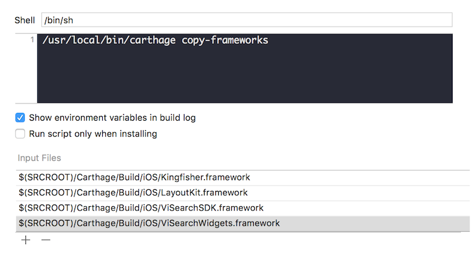
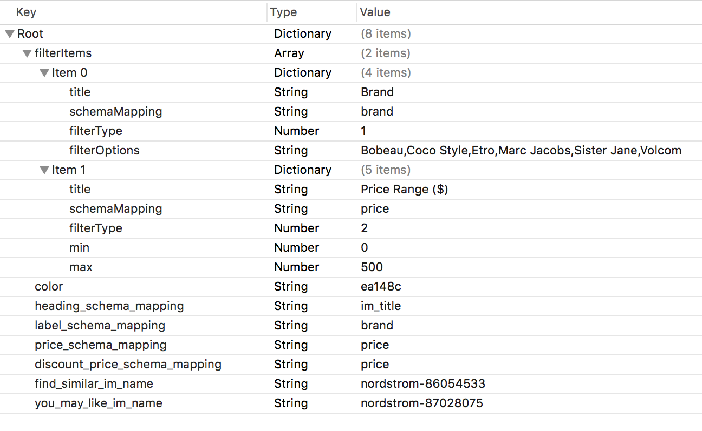
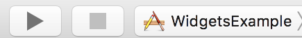
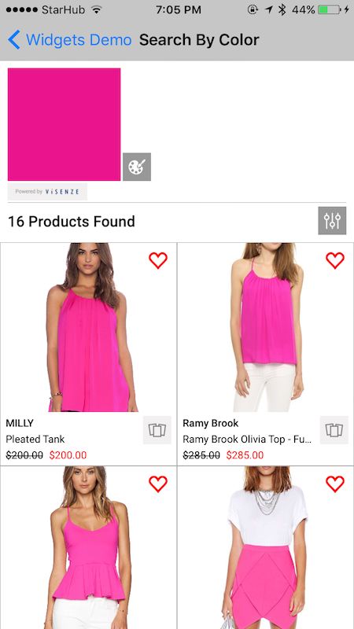

# ViSearch Swift Widgets SDK
&nbsp;[](https://github.com/Carthage/Carthage)&nbsp;[](https://github.com/visenze/visearch-widget-swift)
---

<!-- toc -->

- [1. Overview](#1-overview)
- [2. Requirements](#2-requirements)
- [3. Setup](#3-setup)
  * [3.1 Setup your ViSenze account](#31-setup-your-visenze-account)
  * [3.2 Upload your datafeed](#32-upload-your-datafeed)
- [4. Installation](#4-installation)
  * [4.1 CocoaPods](#41-cocoapods)
  * [4.2 Carthage](#42-carthage)
  * [4.3 App Permission](#43-app-permission)
  * [4.4 Run Demo App](#44-run-demo-app)
- [5. Initialization](#5-initialization)
  * [5.1 ViSenze Search Keys](#51-visenze-search-keys)
  * [5.2 Product Card Schema Mapping](#52-product-card-schema-mapping)
  * [5.3 Product Card Display Setting](#53-product-card-display-setting)
  * [5.4 Common Search Settings](#54-common-search-settings)
- [6. Solutions](#6-solutions)
  * [6.1 Find Similar](#61-find-similar)
  * [6.2 You May Also Like](#62-you-may-also-like)
  * [6.3 Search by Image](#63-search-by-image)
  * [6.4 Search by Color](#64-search-by-color)
- [7. Implement ViSenze Analytics](#7-implement-visenze-analytics)
- [8. Filtering](#8-filtering)
- [9. Customization](#9-customization)
  * [9.1 Widgets Theme](#91-widgets-theme)
  * [9.2 Advanced](#92-advanced)
  * [9.3 Custom Search Bar](#93-custom-search-bar)

<!-- tocstop -->

## 1. Overview

Search and monetize your product images with our effective, easy-to-use, and customizable SDK widgets.

We have launched four solutions that would be fit into your various use cases.

- **Find Similar**: Automatically find visually similar items from your inventory with a simple click 
- **You May Also Like**: Recommend products customers may like using visual recognition and custom rules
- **Search by Image**: Search for matching or similar items from your database with built-­in automated object recognition 
- **Search by Color**: Search and discover products by selecting from a vast color spectrum

API documentation: [https://visenze.github.io/visearch-widget-swift/](https://visenze.github.io/visearch-widget-swift/)

## 2. Requirements

- iOS 8.0+ 
- Xcode 8.1+
- Swift 3.0+

## 3. Setup

### 3.1 Setup your ViSenze account
In order to use our widgets, please setup your ViSenze account. Please refer to our developer documentation for [set-up instructions](http://developers.visenze.com/setup/#Set-up-your-ViSenze-account).

To use the mobile widgets, you will need to get the API keys (access & secret key) with `search-only` permission. 

### 3.2 Upload your datafeed

For testing, you will need to upload your datafeed in ViSenze [dashboard](https://dashboard.visenze.com/) and [configure schema fields](http://developers.visenze.com/setup/#Configure-schema-fields) . For widgets integration, the schema fields requirements are as below:

|Meta-data|Schema | Type | Required | Searchable| Description | Example|
|---------|-------|------|-----------|-----------|-------------|--------|
|Image Id|im_name|string|Yes|Yes|Unique identifier for the image. Generated automatically in ViSenze dashboard.|red-polka-dress.jpg, 2720f503-a0d9-4516-8803-19052fbf343c |
|Image URL|im_url|string|Yes|No|URL for product image. Generated automatically in ViSenze dashboard.|http://somesite.com/abc.jpg|
|Mobile Image URL| custom | string | No | No | Mobile friendly image url for faster loading in mobile app. If this is not provided, im_url will be used to display product image| http://somesite.com/small-img.png|
|Title|custom| string | Yes | Optional | Product title which will appear below product image | Black dress |
|Description|custom| text | No | Optional | Product description which may appear in product detail page  | Black dress |
|Brand| custom | string | No | Yes | Optional field for displaying in the product card. Can be used for filtering. | Nike, Adidas |
|Category| custom | string | No | Yes | Product category. Can be used for filtering. | Dress, Top, Eyewear, Watch , etc|
|Price| custom | float/int | Yes | Yes | Product original retail price. Can be used for ranged filtering | 49.99 |
| Discount Price | custom | float/int | No | Yes | Discount product price. Can be used for ranged filtering | 40.99 | 
   
## 4. Installation

### 4.1 CocoaPods

[CocoaPods](http://cocoapods.org) is a dependency manager for Cocoa projects. You can install it with the following command:

```bash
$ sudo gem install cocoapods
```

> CocoaPods 1.1.0+ is required to build ViSearchWidgets.

Go to your Xcode project directory to create an empty Podfile:

```
pod init
```

To integrate ViSearchWidgets into your Xcode project using CocoaPods, specify it in your `Podfile`:

```ruby
source 'https://github.com/CocoaPods/Specs.git'
platform :ios, '10.0'
use_frameworks!

target '<Your Target Name>' do
    pod 'ViSearchWidgets', '~> 0.1'
end
```
You should change version 0.1 to the latest version of ViSearchWidgets. The version numbers can be viewed under the current Github project tags.

Then, run the following command:

```bash
$ pod install
```

### 4.2 Carthage

[Carthage](https://github.com/Carthage/Carthage) is a decentralized dependency manager that builds your dependencies and provides you with binary frameworks.

You can install Carthage with [Homebrew](http://brew.sh/) using the following command:

```bash
$ brew update
$ brew install carthage
```

Alternately, you can download and run the `Carthage.pkg` file for the latest [release](https://github.com/Carthage/Carthage/releases). 

To integrate ViSearchWidgets into your Xcode project using Carthage:

1. Create a `Cartfile` :

 ```ogdl
 github "visenze/visearch-widget-swift" ~> 0.1
 ```
 You should change version 0.1 to the latest version of ViSearchWidgets. The version numbers can be viewed under the current Github project tags.

2. Run `carthage update --platform iOS --no-use-binaries` 

 This will fetch dependencies (Kingfisher, LayoutKit, visearch-sdk-swift, visearch-widget-swift) into Carthage/Checkouts folder, then build the framework. 

3. On your application target's “General” settings tab, in the `Embedded Binary` section, drag and drop the following frameworks from the `Carthage/Build/iOS` folder:

 - Kingfisher.framework
 - LayoutKit.framework
 - ViSearchSDK.framework
 - ViSearchWidgets.framework  

 
 
 Click on "Build Phases" tab, verify that the "Framework Search Path" includes `$(PROJECT_DIR)/Carthage/Build/iOS`

4. Add the following frameworks to "Linked Frameworks and Libraries" section: MediaPlayer, Photos, AVFoundation.

5. On your application target’s “Build Phases” settings tab, click the “+” icon and choose “New Run Script Phase”. Create a Run Script in which you specify your shell (ex: `bin/sh`), add the following contents to the script area below the shell:

  ```sh
  /usr/local/bin/carthage copy-frameworks
  ```

  and add the paths to the frameworks you want to use under `Input Files`, e.g.:

  ```
  $(SRCROOT)/Carthage/Build/iOS/Kingfisher.framework
  $(SRCROOT)/Carthage/Build/iOS/LayoutKit.framework
  $(SRCROOT)/Carthage/Build/iOS/ViSearchSDK.framework
  $(SRCROOT)/Carthage/Build/iOS/ViSearchWidgets.framework
  ```
  


### 4.3 App Permission

- **Add Privacy Usage Description** :

 iOS 10 now requires user permission to access camera and photo library. To use "Search by Image" solution, please add description for NSCameraUsageDescription, NSPhotoLibraryUsageDescription in your Info.plist. More details can be found [here](https://developer.apple.com/library/content/documentation/General/Reference/InfoPlistKeyReference/Articles/CocoaKeys.html#//apple_ref/doc/uid/TP40009251-SW24).

 
 
 You may also want to configure the "App Transport Security Settings" option to allow loading of product images.
 
### 4.4 Run Demo App 

The source code of the Demo application is under the `WidgetsExample` folder. Please open the WidgetsExample.xcodeproj and configure the API keys/ schema mapping to run the demo.

- Configure API keys:

 Please refer to section [3.1](#31-setup-your-visenze-account) for instructions to get the API keys. First, you will need to copy/drag the empty `ViApiKeys.plist` file (at the same location to this README file) to the demo project.
 
 
 
 Next, you can enter the `search-only` access and secret keys into the plist file.
 
- Configure schema mapping

 As mentioned in section [3.2](#32-upload-your-datafeed) , you will need to upload your datafeed and configure the schema fields. The fields which hold product's information can then be displayed in the widgets via the `Product Card` UI component. Please see the below screenshot for example.
 
 
 
 You will need edit the `SampleData.plist` (the file was below ViApiKeys.plist in the `Configure API keys` section screenshot) to configure the schema mapping for your sample data feed.
 
 
    
 - `heading_schema_mapping` : refers to the schema mapping for the `Heading` field in `Product Card` component. In the screenshot, it was used to display the product title (the schema field is `im_title` which is a custom field in the feed).
 - `label_schema_mapping` : refers to the schema mapping for the `Label` field in `Product Card` component. In the screenshot, it was used to display the product brand. 
 - `price_schema_mapping` : refers to the schema mapping for the `Price` field in `Product Card` component. In the screenshot, it was used to display the product original retail price. 
 - `discount_price_schema_mapping` : refers to the schema mapping for the `Discount Price` field in `Product Card` component. In the screenshot, it was used to display the product discount price. This is optional and may not be applicable for your data feed. 
  - `color` : sample color code used for "Search by Color" widget demo.
  - `find_similar_im_name` : sample im_name used for "Find Similar" widget demo. You can browse the product images in ViSenze dashboard and used any existing im_name to test.
  - `you_may_like_im_name` : sample im_name used for "You May Also Like" widget demo. You can browse the product images in ViSenze dashboard and used any existing im_name to test.
  - `filterItems` : configure the types of fitler used in demo app. Two types of filters are supported (Category and Range filters). 

- Download and run the `Carthage.pkg` file for the latest [release](https://github.com/Carthage/Carthage/releases). The demo app is built with Carthage. After Carthage  installation, you will need to run the following command:

 `carthage update --platform iOS --no-use-binaries` 

- Configure scheme: At the final step, you will need to change the Running Scheme to "WidgetsExample". You are now ready to run the demo app.

 

## 5. Initialization

All of our widgets (constructed as view controllers sub-classes of [ViBaseSearchViewController](https://visenze.github.io/visearch-widget-swift/Classes/ViBaseSearchViewController.html) ) require the following common initialization steps.

### 5.1 ViSenze Search Keys

`ViSearch` **must** be initialized with an accessKey/secretKey pair **before** it can be used. Please refer to section [3.1](#31-setup-your-visenze-account) on how to obtain the keys .You can do this initialization once in AppDelegate class.

```swift
import ViSearchSDK
import ViSearchWidgets
...
// using default ViSearch API client which will connect to Visenze's server
ViSearch.sharedInstance.setup(accessKey: "YOUR_ACCESS_KEY", secret: "YOUR_SECRET_KEY")

...
// or using customized client, which connects to your own proxy server
client = ViSearchClient(baseUrl: yourUrl, accessKey: accessKey, secret: secret)
...
```

### 5.2 Product Card Schema Mapping

As mentioned in section [3.2](#32-upload-your-datafeed) , you will need to upload your datafeed and configure the schema fields. The fields which hold product's information can then be displayed in the widgets via the `Product Card` UI component. Please see the below screenshot for example.
 
 
 
You can then configure the widgets (which are view controllers) as below:

```swift
   
// create the widgets as view controller      
...
...
// configure schema mapping for product card UI component in the widget             
controller.schemaMapping.heading = ...  // mapping for heading element e.g. for displaying product title
controller.schemaMapping.label = ...   // mapping for label element e.g. for displaying product brand
controller.schemaMapping.price = ... // mapping for price element e.g. for displaying product original retail price
controller.schemaMapping.discountPrice = ... // mapping for discount price element e.g. for displaying product discount price. May not be available in product feed
controller.schemaMapping.productUrl = ... // mapping for product image URL. default to "im_url" schema field.

```

### 5.3 Product Card Display Setting

You can also configure various setting for the product card.

```swift

// configure product image size and content mode
controller.imageConfig.size = CGSize(width: imageWidth, height: imageHeight )
controller.imageConfig.contentMode = .scaleAspectFill

// configure product card box size
controller.itemSize = ...

// add border to product card
controller.productCardBorderColor = UIColor.lightGray
controller.productCardBorderWidth = 0.7

// add only bottom and right borders for product card
controller.productBorderStyles = [.RIGHT , .BOTTOM]

// display a strike through text through the original retail price (if discount price is available)
controller.priceConfig.isStrikeThrough = true

```

### 5.4 Common Search Settings

```swift
// create search params (depending on the widget)
// for example, in Find Similar, You May Also Like, parameters are constructed by providing im_name:
// let params = ViSearchParams(imName: im_name) 

// set various search settings

// limit search to return 16 most similar results
params.limit = 16

// retrieve additional meta-data (in addition to what was mentioned in schema mapping)
params.fl = ["category"]

// set search paramters
controller.params = params
```

For advanced configuration of search parameters refer to this [link](https://github.com/visenze/visearch-sdk-swift#6-advanced-search-parameters) .

## 6. Solutions

### 6.1 Find Similar

Visually similar products can be activately searched by the user on the product listing or product detail screen. Our algorithm assigns appropriate weights to different attributes to determine a final similarity score, and product results are displayed in order of the score. This solution provides an opportunity for shoppers to discover other relevant results based on visual similarity. 


The products are displayed in a grid.

Below is sample code for using "Find Similar" widget. Please read section 5 on important initialization steps.

```swift

// create search parameter which will search for similar products to sample_im_name.jpg
if let params = ViSearchParams(imName: "sample_im_name.jpg") {
            
    // 1. create Find Similar widget
    let similarController = ViFindSimilarViewController()
    
    // configure max of 16 most similar results to return
    params.limit = 16
    
    // 2. set search parameters
    similarController.searchParams = params
    
    // 3. configure schema mapping (refer to section 5.2)
    // Assumption: your schema data feed include "im_title", "brand", "price" fields which store data for product title, brand and current price
    similarController.schemaMapping.heading = "im_title"
    similarController.schemaMapping.label = "brand"
    similarController.schemaMapping.price = "price"
   
    // 4. configure product image size and content mode
    let containerWidth = self.view.bounds.width 
    let imageWidth = containerWidth / 2.5
    let imageHeight = imageWidth * 1.2
    
    similarController.imageConfig.size = CGSize(width: imageWidth, height: imageHeight )
    // configure image content mode
    similarController.imageConfig.contentMode = .scaleAspectFill
     
    // 5. configure products to display in 2 columns
    similarController.itemSize = similarController.estimateItemSize(numOfColumns: 2, containerWidth: containerWidth)
    
    // 6. misc setting (Optional)
    // configure border color if necessary
    similarController.productCardBorderColor = UIColor.lightGray
    similarController.productCardBorderWidth = 0.7
    
     // configure spacing between product cards on the same row i.e. the column spacing
    similarController.itemSpacing = 0
    
    // configure spacing between the rows
    similarController.rowSpacing = 0
    
    // 7. configure delegate to listen for various events such as when user clicks on Action button
    similarController.delegate = self
    
    // 8. open widget with navigation controller
    self.navigationController?.pushViewController(similarController, animated: true)
    
    // 9. trigger web service to ViSenze server
    similarController.refreshData()
    
}

```

Important API docs:

- [ViFindSimilarViewController](https://visenze.github.io/visearch-widget-swift/Classes/ViFindSimilarViewController.html)
- [ViGridSearchViewController](https://visenze.github.io/visearch-widget-swift/Classes/ViGridSearchViewController.html)
- [ViBaseSearchViewController](https://visenze.github.io/visearch-widget-swift/Classes/ViBaseSearchViewController.html)
- [ViSearchViewControllerDelegate](https://visenze.github.io/visearch-widget-swift/Protocols/ViSearchViewControllerDelegate.html)

### 6.2 You May Also Like

This solution showcases recommended products on the product detail screen. You can apply custom recommendation rules for each application based on your customer demographic or other metadata such as brand, price, color etc. Our algorithm will then create a similarity score and rank products in order of score. This solution provides an opportunity for you to promote more products based on visual similarity and other relevant recommendation rules.


The products are displayed in a horizontal scroll view.

Below is sample code for using "You May Also Like" widget. Please read section 5 on important initialization steps. The widget (`ViRecommendationViewController`) should be used in the detail screen as a [child view controller](https://developer.apple.com/library/content/featuredarticles/ViewControllerPGforiPhoneOS/ImplementingaContainerViewController.html). There are 2 ways to present a child view controller.

- Present ViRecommendationViewController programatically as child view controller: 

```swift

// create search parameter which will search for similar products to sample_im_name.jpg
if let params = ViSearchParams(imName: "sample_im_name.jpg") {
            
    // 1. create You May Also Like widget
    let controller = ViRecommendationViewController()
    
    // configure max of 10 most similar results to return
    params.limit = 10
    
    // 2. set search parameters
    controller.searchParams = params
    
    // 3. configure schema mapping (refer to section 5.2)
    // Assumption: your schema data feed include "im_title", "brand", "price" fields which store data for product title, brand and current price
    controller.schemaMapping.heading = "im_title"
    controller.schemaMapping.label = "brand"
    controller.schemaMapping.price = "price"
   
    // 4. configure product image size and content mode
    let containerWidth = self.view.bounds.width 
    
    // this will let 2.5 images appear on screen within containerWidth viewbox
    let imageWidth = controller.estimateItemWidth(2.5, containerWidth: containerWidth)
    let imageHeight = imageWidth * 1.2
                
    controller.imageConfig.size = CGSize(width: imageWidth, height: imageHeight )
    // configure image content mode
    controller.imageConfig.contentMode = .scaleAspectFill
     
    // 5. configure product card box size
    // IMPORTANT: this must be called last after schema mapping configuration as we calculate the item size based on whether a field is available
    // e.g. if label is nil in the mapping, then it will not be included in the height calculation of product card
    // the product card height is dynamic and will depend on schema mapping
    // the  product card width is set to image width            
    controller.itemSize = controller.estimateItemSize()
    
    // 6. misc setting (Optional)
    
    // configure left spacing
    controller.paddingLeft = 8.0
    
    // configure border color if necessary
    controller.productCardBorderColor = UIColor.lightGray
    controller.productCardBorderWidth = 0.7
    
     // configure spacing between product cards on the same row i.e. the column spacing
    controller.itemSpacing = 0
     
    // 7. configure delegate to listen for various events such as when user clicks on Action button
    controller.delegate = self
        
    
    // 8a. if you are presenting this view programmatically i.e. not from storyboard , you will need to add the following code to present as view controller
    
    // set the frame and call necessary methods in current view controller
    controller.view.frame = CGRect(x: 0, y: 320, width: self.view.bounds.width, height: controller.itemSize.height )
    self.addChildViewController(controller)
    self.view.addSubview(controller.view)
    controller.didMove(toParentViewController: self)
          
    // 9. trigger web service to ViSenze server
    controller.refreshData()
    
}

```

- Present child view controller from storyboard:

You will need to drag in a Container view with an embedded segue within the view controller. Instructions can be found [here](https://developer.apple.com/library/content/featuredarticles/ViewControllerPGforiPhoneOS/ImplementingaContainerViewController.html) and also in the WidgetsExample demo.

Set the child controller class as ViRecommendationViewController in Interface Builder under ViSearchWidgets module.

Then you can set up the controller within the prepare method as below:

```swift
override func prepare(for segue: UIStoryboardSegue, sender: Any?) {
  if segue.identifier == "yourEmbedSegueIdentifier" {
	    
	 let controller = segue.destination as! ViRecommendationViewController
	   
	 if let params = ViSearchParams(imName: "sample_im_name.jpg") {
            
      //1. configure max of 10 most similar results to return
      params.limit = 10
    
      // 2. set search parameters
      controller.searchParams = params
    
      // 3. configure schema mapping (refer to section 5.2)
      // Assumption: your schema data feed include "im_title", "brand", "price" fields which store data for product title, brand and current price
      controller.schemaMapping.heading = "im_title"
      controller.schemaMapping.label = "brand"
      controller.schemaMapping.price = "price"
   
      // 4. configure product image size and content mode
      let containerWidth = self.view.bounds.width 
    
      // this will let 2.5 images appear on screen within containerWidth viewbox
      let imageWidth = controller.estimateItemWidth(2.5, containerWidth: containerWidth)
      let imageHeight = imageWidth * 1.2
                
      controller.imageConfig.size = CGSize(width: imageWidth, height: imageHeight )
      // configure image content mode
      controller.imageConfig.contentMode = .scaleAspectFill
     
       // 5. configure product card box size
       // IMPORTANT: this must be called last after schema mapping configuration as we calculate the item size based on whether a field is available
       // e.g. if label is nil in the mapping, then it will not be included in the height calculation of product card
       // the product card height is dynamic and will depend on schema mapping
       // the  product card width is set to image width            
       controller.itemSize = controller.estimateItemSize()
    
       // 6. misc setting (Optional)
    
       // configure left spacing
       controller.paddingLeft = 8.0
    
       // configure border color if necessary
       controller.productCardBorderColor = UIColor.lightGray
       controller.productCardBorderWidth = 0.7
    
        // configure spacing between product cards on the same row i.e. the column spacing
       controller.itemSpacing = 8
     
        // 7. configure delegate to listen for various events such as when user clicks on Action button
        controller.delegate = self
        
             
        // 8. trigger web service to ViSenze server
        controller.refreshData()
    
    }     
	        	            
  }      
}
```

Important API docs:

- [ViRecommendationViewController](https://visenze.github.io/visearch-widget-swift/Classes/ViRecommendationViewController.html)
- [ViHorizontalSearchViewController](https://visenze.github.io/visearch-widget-swift/Classes/ViHorizontalSearchViewController.html)
- [ViBaseSearchViewController](https://visenze.github.io/visearch-widget-swift/Classes/ViBaseSearchViewController.html)
- [ViSearchViewControllerDelegate](https://visenze.github.io/visearch-widget-swift/Protocols/ViSearchViewControllerDelegate.html)

### 6.3 Search by Image

Shoppers can snap or upload a photo of the product they are looking for, find the same or similar options across price points, brands etc., and order the product that best meets their needs. The solution provides an innovative and easy way for shoppers to find items they want without needing keywords.


The products are displayed in a grid.

Below is sample code for using "Search by Image" widget. Please read section 5 on important initialization steps and section 4.3 on important app permissions.

```swift

// the entry point for Search by Image is to open a camera to take photo
// 1. we use CameraViewController for photo taking / select photo
let cameraViewController = CameraViewController(croppingEnabled: false, allowsLibraryAccess: true) { [weak self] image, asset in

    // after photo is taken or user has selected from photo library, we dismiss the modal controller
    self?.dismiss(animated: true, completion: nil)
    
    // user cancel photo taking
    if( image == nil) {
        return
    }
    
    // 2. create the Search by Image widget and save recent photo
    let controller = ViSearchImageViewController()
    
    // save recent photo asset (which can be a recent taken photo from camera)
    // the asset can also be from the user's photo library
    controller.asset = asset
    
    // create search parameter
    let params = ViUploadSearchParams(image: image!)
    
    // configure max of 16 most similar results to return
    params.limit = 16
    controller.searchParams = params
    
    // enable cropping and select photo from library
    controller.croppingEnabled = true
    controller.allowsLibraryAccess = true
    
    // 3. configure schema mapping (refer to section 5.2)
    // Assumption: your schema data feed include "im_title", "brand", "price" fields which store data for product title, brand and current price
    controller.schemaMapping.heading = "im_title"
    controller.schemaMapping.label = "brand"
    controller.schemaMapping.price = "price"
   
    // 4. configure product image size and content mode
    let containerWidth = self.view.bounds.width 
    let imageWidth = containerWidth / 2.5
    let imageHeight = imageWidth * 1.2
    
    controller.imageConfig.size = CGSize(width: imageWidth, height: imageHeight )
    // configure image content mode
    controller.imageConfig.contentMode = .scaleAspectFill
     
    // 5. configure products to display in 2 columns
    controller.itemSize = similarController.estimateItemSize(numOfColumns: 2, containerWidth: containerWidth)
    
    // 6. misc setting (Optional)
    // configure border color if necessary
    controller.productCardBorderColor = UIColor.lightGray
    controller.productCardBorderWidth = 0.7
    
     // configure spacing between product cards on the same row i.e. the column spacing
    controller.itemSpacing = 0
    
    // configure spacing between the rows
    controller.rowSpacing = 0
    
    // 7. configure delegate to listen for various events such as when user clicks on Action button
    controller.delegate = self
    
    // 8. open widget with navigation controller
    self.navigationController?.pushViewController(similarController, animated: true)
    
    // 9. trigger web service to ViSenze server
    controller.refreshData()
    
}

// present the camera to take photo or select from library
present(cameraViewController, animated: true, completion: nil)
```

Important API docs:

- [ViSearchImageViewController](https://visenze.github.io/visearch-widget-swift/Classes/ViSearchImageViewController.html)
- [ViGridSearchViewController](https://visenze.github.io/visearch-widget-swift/Classes/ViGridSearchViewController.html)
- [ViBaseSearchViewController](https://visenze.github.io/visearch-widget-swift/Classes/ViBaseSearchViewController.html)
- [ViSearchViewControllerDelegate](https://visenze.github.io/visearch-widget-swift/Protocols/ViSearchViewControllerDelegate.html)
- [CameraViewController](https://visenze.github.io/visearch-widget-swift/Classes/CameraViewController.html)

### 6.4 Search by Color

Shoppers can search your entire indexed catalogue of products for an item with a particular color and then narrow down the results by attributes or fields such as category, brand, price, etc. Our algorithm can search the catalogue by a set of pre-selected colors from a color palette or a vast spectrum of colors.



The products are displayed in a grid.

Below is sample code for using "Search by Color" widget. Please read section 5 on important initialization steps.

```swift

// create search parameter with color code 00ff00
if let params = ViColorSearchParams(color: "00ff00") {
            
    // 1. create controller
    let controller = ViColorSearchViewController()
    
    // configure max of 16 most similar results to return
    params.limit = 16
    
    // 2. set search parameters
    controller.searchParams = params
    
    // 3. configure schema mapping (refer to section 5.2)
    // Assumption: your schema data feed include "im_title", "brand", "price" fields which store data for product title, brand and current price
    controller.schemaMapping.heading = "im_title"
    controller.schemaMapping.label = "brand"
    controller.schemaMapping.price = "price"
   
    // 4. configure product image size and content mode
    let containerWidth = self.view.bounds.width 
    let imageWidth = containerWidth / 2.5
    let imageHeight = imageWidth * 1.2
    
    controller.imageConfig.size = CGSize(width: imageWidth, height: imageHeight )
    // configure image content mode
    controller.imageConfig.contentMode = .scaleAspectFill
     
    // 5. configure products to display in 2 columns
    controller.itemSize = similarController.estimateItemSize(numOfColumns: 2, containerWidth: containerWidth)
    
    // 6. misc setting (Optional)
    // configure border color if necessary
    controller.productCardBorderColor = UIColor.lightGray
    controller.productCardBorderWidth = 0.7
    
     // configure spacing between product cards on the same row i.e. the column spacing
    controller.itemSpacing = 0
    
    // configure spacing between the rows
    controller.rowSpacing = 0
    
    // 7. configure delegate to listen for various events such as when user clicks on Action button
    controller.delegate = self
    
    // 8. open widget with navigation controller
    self.navigationController?.pushViewController(similarController, animated: true)
    
    // 9. trigger web service to ViSenze server
    controller.refreshData()
    
}

```

Important API docs:

- [ViColorSearchViewController](https://visenze.github.io/visearch-widget-swift/Classes/ViColorSearchViewController.html)
- [ViGridSearchViewController](https://visenze.github.io/visearch-widget-swift/Classes/ViGridSearchViewController.html)
- [ViBaseSearchViewController](https://visenze.github.io/visearch-widget-swift/Classes/ViBaseSearchViewController.html)
- [ViSearchViewControllerDelegate](https://visenze.github.io/visearch-widget-swift/Protocols/ViSearchViewControllerDelegate.html)

## 7. Implement ViSenze Analytics

The analytics reports page is located in your ViSenze Dashboard and allows you to conveniently see a high-level view of the performance of each of the solutions through click metrics as well as usage statistics. With the analytics reporting tool, you can easily track the performance to quantify the value-add of our solutions through metrics such as click-through rate, add-to-wishlist rate, add-to-cart rate, and click rank.

Here is the list of actions that our analytics reports support:

|Action recorded| Description |
|:---|:---|
|`click`|When user click to view the detail of the product|
|`add_to_cart`| When user click the button to add the product to cart|
|`add_to_wishlist`| When user click the button to add the product to wishlist|

By integrating with our solution widgets, the implementation of tracking `click` (click on a product on search results) and `add_to_wishlist` (click on action button default to heart icon) actions are already included.

However, if you would like to track actions being performed outside of the widgets UI or you want to customize your own UI, the action tracking needs to be implemented explicitly. For each action sent, a `reqId` needs to be sent together with the action name. The `reqId` binds the action with its triggering API calls to our service. Each time an API call is made to our service, a `reqId` will be returned in the response. Any user action that is generated by the results returned from this particular API call should be bound with its `reqId`. Please refer to the code snippets below for the implementation.

The user action can be sent in this way:

```swift

if sender is ViBaseSearchViewController {
    let controller = sender as! ViBaseSearchViewController
    let recentReqId = controller.reqId
    
    let params = ViTrackParams(reqId: recentReqId, action: "custom_action" )
	 params.imName = product.im_name

	// send tracking request to server
	ViSearch.sharedInstance.track(params: params!, handler: nil)
}

```
## 8. Filtering

You can configure the filter component for `Find Similar`, `Search by Image` and `Search by Color` widgets search results. Two types of filters are supported: 

- Range filter (e.g. for price) ([ViFilterItemRange](https://visenze.github.io/visearch-widget-swift/Classes/ViFilterItemRange.html))
- Multi-selection category filter (e.g. for product category, brand) ([ViFilterItemCategory](https://visenze.github.io/visearch-widget-swift/Classes/ViFilterItemCategory.html))

The filters can be created as below:

```swift
var items : [ViFilterItem] = []

// configure a 'price' range filter item
// Assumption: there is a int/float field named "price" in your schema data feed
let min : Int = 0
let max : Int = 500
                            
let item = ViFilterItemRange(title: "Price Range ($)", schemaMapping: "price", min: min, max: max)
items.append(item)

// configure a category filter item for 'brand' schema field
// Assumption: there is a string field named 'brand' in your schema
let brandString = "Bobeau,Coco Style,Etro,Marc Jacobs,Sister Jane,Volcom"
let options = brandString.components(separatedBy: ",")                          
var optionArr : [ViFilterItemCategoryOption] = []
for o in options {
    optionArr.append( ViFilterItemCategoryOption(option: o) )
}
                            
let brandFilterItem = ViFilterItemCategory(title: "Brand", schemaMapping: "brand", options: optionArr)
items.append(brandFilterItem)

```

To display the filters, you just need to set the filterItems property of the widgets:

```swift
controller.filterItems = items
```

Important API docs:

- [ViFilterItemRange](https://visenze.github.io/visearch-widget-swift/Classes/ViFilterItemRange.html)
- [ViFilterItemCategory](https://visenze.github.io/visearch-widget-swift/Classes/ViFilterItemCategory.html)
- [ViFilterItem](https://visenze.github.io/visearch-widget-swift/Classes/ViFilterItem.html)

## 9. Customization

### 9.1 Widgets Theme

To customize the color, styles of the widgets and button, you can look at the following classes:

- [ViTheme](https://visenze.github.io/visearch-widget-swift/Classes/ViTheme.html) : default global configuration for text fonts, button colors, sizes, etc.

 You can configure via the ViTheme singleton:
 
 ```swift
 // configure default font 
 ViTheme.sharedInstance.default_font = ...
 
 ``` 
 
- [ViButtonConfig](https://visenze.github.io/visearch-widget-swift/Structs/ViButtonConfig.html) : default style for buttons
- [ViLabelConfig](https://visenze.github.io/visearch-widget-swift/Structs/ViLabelConfig.html) : default style for labels (heading, label, price, discount price)
- [ViImageConfig](https://visenze.github.io/visearch-widget-swift/Structs/ViImageConfig.html) : product image configuration

For specific widget customization (e.g. show/hide buttons, change text/button colors, etc), refer to [UI Settings](https://visenze.github.io/visearch-widget-swift/Classes/ViBaseSearchViewController.html#/UI%20settings) section of `ViBaseSearchViewController`.

### 9.2 Advanced 

For advanced use cases where you need to create your own widgets or want to modify/extend the product card, please hook into the [ViSearchViewControllerDelegate](https://visenze.github.io/visearch-widget-swift/Protocols/ViSearchViewControllerDelegate.html) callbacks.

- [configureCell(sender:collectionView:indexPath:cell:)](https://visenze.github.io/visearch-widget-swift/Protocols/ViSearchViewControllerDelegate.html#/s:FP15ViSearchWidgets30ViSearchViewControllerDelegate13configureCellFT6senderPs9AnyObject_14collectionViewCSo16UICollectionView9indexPathV10Foundation9IndexPath4cellCSo20UICollectionViewCell_T_) : allow you to configure the product cell before displaying. You can retrieve various product card UI elements by tag in the cell.contentView e.g. cell.contentView.viewWithTag(ViProductCardTag.productImgTag.rawValue) and configure accordingly. The tags are defined [here](https://visenze.github.io/visearch-widget-swift/Enums/ViProductCardTag.html).
- [configureLayout(sender:layout:)](https://visenze.github.io/visearch-widget-swift/Protocols/ViSearchViewControllerDelegate.html#/s:FP15ViSearchWidgets30ViSearchViewControllerDelegate15configureLayoutFT6senderPs9AnyObject_6layoutCSo26UICollectionViewFlowLayout_T_) : if you need to have your own controller which will change the layout for the built in collectionview.
- [willShowSimilarControler(sender:controller:collectionView:indexPath:product:)](https://visenze.github.io/visearch-widget-swift/Protocols/ViSearchViewControllerDelegate.html#/s:FP15ViSearchWidgets30ViSearchViewControllerDelegate24willShowSimilarControlerFT6senderPs9AnyObject_10controllerCS_27ViFindSimilarViewController14collectionViewCSo16UICollectionView9indexPathV10Foundation9IndexPath7productCS_9ViProduct_T_) : configure similar controller before display.
- [willShowFilterControler(sender:controller:)](https://visenze.github.io/visearch-widget-swift/Protocols/ViSearchViewControllerDelegate.html#/s:FP15ViSearchWidgets30ViSearchViewControllerDelegate23willShowFilterControlerFT6senderPs9AnyObject_10controllerCS_22ViFilterViewController_T_) : configure filter controller before display.

### 9.3 Custom Search Bar

To add "Search by Image" and "Search by Color" buttons to the UISearchBar, please refer to the `WidgetsExample` project > `CustomSearchBarViewController` class.


