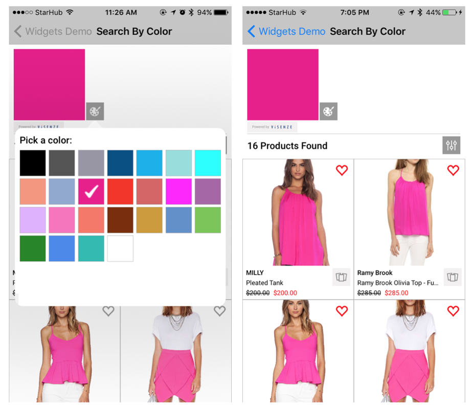

# ViSearch Swift Widgets SDK
&nbsp;[](https://github.com/Carthage/Carthage)&nbsp;[](https://github.com/visenze/visearch-widget-swift)
---

<!-- toc -->

- [1. Overview](#1-overview)
- [2. Requirements](#2-requirements)
- [3. Setup](#3-setup)
  * [3.1 Setup your ViSenze account](#31-setup-your-visenze-account)
  * [3.2 Upload your datafeed](#32-upload-your-datafeed)
- [4. Install the SDK](#4-install-the-sdk)
  * [4.1 CocoaPods](#41-cocoapods)
  * [4.2 Carthage](#42-carthage)
  * [4.3 Run Demo App](#43-run-demo-app)
- [5. Configure the SDK](#5-configure-the-sdk)
  * [5.1 Api Keys](#51-api-keys)
  * [5.2 App Permission](#52-app-permission)
- [6. Solution Widgets](#6-solution-widgets)
  * [6.0 Common Widget Configuration](#60-common-widget-configuration)
    + [6.0.1 Product Card Schema Mapping](#601-product-card-schema-mapping)
    + [6.0.2 Product Card Display Setting](#602-product-card-display-setting)
    + [6.0.3 Common Search Settings](#603-common-search-settings)
  * [6.1 Find Similar](#61-find-similar)
  * [6.2 You May Also Like](#62-you-may-also-like)
  * [6.3 Search by Image](#63-search-by-image)
  * [6.4 Search by Color](#64-search-by-color)
- [7. Customization](#7-customization)
  * [7.1 Filtering](#71-filtering)
  * [7.2 Widgets Theme](#72-widgets-theme)
  * [7.3 Advanced](#73-advanced)
  * [7.4 Errors Handling](#74-errors-handling)
  * [7.5 Custom Search Bar](#75-custom-search-bar)
    + [7.5.1 Add Camera & Color Picker Buttons to UISearchBar](#751-add-camera--color-picker-buttons-to-uisearchbar)
    + [7.5.2 Color Picker](#752-color-picker)
    + [7.5.3 Camera Button](#753-camera-button)
  * [7.6 Orientation Changes](#76-orientation-changes)
- [8. Implement ViSenze Analytics](#8-implement-visenze-analytics)
  * [8.1 Default Actions](#81-default-actions)
    + [Custom Action Button Tracking](#custom-action-button-tracking)
  * [8.2 Custom Actions](#82-custom-actions)
- [9. Known Issues](#9-known-issues)

<!-- tocstop -->

## 1. Overview

Search and monetize your product images with our effective, easy-to-use, and customizable SDK widgets.

We have launched four solutions that would be fit into your various use cases.

- **Find Similar**: Automatically find visually similar items from your inventory with a simple click 
- **You May Also Like**: Recommend products customers may like using visual recognition and custom rules
- **Search by Image**: Search for matching or similar items from your database with built-­in automated object recognition 
- **Search by Color**: Search and discover products by selecting from a vast color spectrum

API documentation: [https://visenze.github.io/visearch-widget-swift/](https://visenze.github.io/visearch-widget-swift/)

To understand quickly what our SDKs offer out of the box, please follow instructions in section 3 and then jump to section 4.3 to run the demo.

## 2. Requirements

- **Supported**: iOS 9.0+ . **Minimum**: iOS 8.0+. 

  - The SDK is tested fully on iOS 9.0+ (real iPhone devices). 
  - iOS 8.x versions are only tested on simulators. 
  
- Xcode 8.1+
- Swift 3.0+


## 3. Setup

### 3.1 Setup your ViSenze account
In order to use our widgets, please setup your ViSenze account. Please refer to our developer documentation for [set-up instructions](http://developers.visenze.com/setup/#Set-up-your-ViSenze-account).

To use the mobile widgets, you will need to get the API keys (access & secret key) with `search-only` permission. 

### 3.2 Upload your datafeed

For testing, you will need to upload your datafeed in ViSenze [dashboard](https://dashboard.visenze.com/) and [configure schema fields](http://developers.visenze.com/setup/#Configure-schema-fields) . For widgets integration, the schema fields requirements are as below:

|Meta-data|Schema | Type | Required | Searchable| Description | Example|
|---------|-------|------|-----------|-----------|-------------|--------|
|Image Id|im_name|string|Yes|Yes|Unique identifier for the image. Generated automatically in ViSenze dashboard.|red-polka-dress.jpg, 2720f503-a0d9-4516-8803-19052fbf343c |
|Image URL|im_url|string|Yes|No|URL for product image. Generated automatically in ViSenze dashboard.|http://somesite.com/abc.jpg|
|Mobile Image URL| custom | string | No | No | Mobile friendly image url for faster loading in mobile app. If this is not provided, im_url will be used to display product image| http://somesite.com/small-img.png|
|Title|custom| string | Yes | Optional | Product title which will appear below product image | Black dress |
|Description|custom| text | No | Optional | Product description which may appear in product detail page  | Black dress |
|Brand| custom | string | No | Yes | Optional field for displaying in the product card. Can be used for filtering. | Nike, Adidas |
|Category| custom | string | No | Yes | Product category. Can be used for filtering. | Dress, Top, Eyewear, Watch , etc|
|Price| custom | float/int | Yes | Yes | Product original retail price. Can be used for ranged filtering | 49.99 |
| Discount Price | custom | float/int | No | Yes | Discount product price. Can be used for ranged filtering | 40.99 | 
   
## 4. Install the SDK

### 4.1 CocoaPods

[CocoaPods](http://cocoapods.org) is a dependency manager for Cocoa projects. You can install it with the following command:

```bash
$ sudo gem install cocoapods
```

> CocoaPods 1.1.0+ is required to build ViSearchWidgets.

Go to your Xcode project directory to create an empty Podfile:

```
pod init
```

To integrate ViSearchWidgets into your Xcode project using CocoaPods, specify it in your `Podfile`:

```ruby
source 'https://github.com/CocoaPods/Specs.git'
platform :ios, '10.0'
use_frameworks!

target '<Your Target Name>' do
    pod 'ViSearchWidgets', '~> 0.1'
end
```
You should change version 0.1 to the latest version of ViSearchWidgets. The version numbers can be viewed under the current Github project tags.

Then, run the following command:

```bash
$ pod install
```

### 4.2 Carthage

[Carthage](https://github.com/Carthage/Carthage) is a decentralized dependency manager that builds your dependencies and provides you with binary frameworks.

You can install Carthage with [Homebrew](http://brew.sh/) using the following command:

```bash
$ brew update
$ brew install carthage
```

Alternately, you can download and run the `Carthage.pkg` file for the latest [release](https://github.com/Carthage/Carthage/releases). 

To integrate ViSearchWidgets into your Xcode project using Carthage:

1. Create a `Cartfile` :

 ```ogdl
 github "visenze/visearch-widget-swift" ~> 0.1
 ```
 You should change version 0.1 to the latest version of ViSearchWidgets. The version numbers can be viewed under the current Github project tags.

2. Run `carthage update --platform iOS --no-use-binaries` 

 This will fetch dependencies (Kingfisher, LayoutKit, visearch-sdk-swift, visearch-widget-swift) into Carthage/Checkouts folder, then build the framework. 

3. On your application target's “General” settings tab, in the `Embedded Binary` section, drag and drop the following frameworks from the `Carthage/Build/iOS` folder:

 - Kingfisher.framework
 - LayoutKit.framework
 - ViSearchSDK.framework
 - ViSearchWidgets.framework  

 
 
 Click on "Build Phases" tab, verify that the "Framework Search Path" includes `$(PROJECT_DIR)/Carthage/Build/iOS`

4. Add the following frameworks to "Linked Frameworks and Libraries" section: MediaPlayer, Photos, AVFoundation.

5. On your application target’s “Build Phases” settings tab, click the “+” icon and choose “New Run Script Phase”. Create a Run Script in which you specify your shell (ex: `bin/sh`), add the following contents to the script area below the shell:

  ```sh
  /usr/local/bin/carthage copy-frameworks
  ```

  and add the paths to the frameworks you want to use under `Input Files`, e.g.:

  ```
  $(SRCROOT)/Carthage/Build/iOS/Kingfisher.framework
  $(SRCROOT)/Carthage/Build/iOS/LayoutKit.framework
  $(SRCROOT)/Carthage/Build/iOS/ViSearchSDK.framework
  $(SRCROOT)/Carthage/Build/iOS/ViSearchWidgets.framework
  ```
  
 
### 4.3 Run Demo App 

The source code of the Demo application is under the `WidgetsExample` folder. Please open the WidgetsExample.xcodeproj and configure the API keys/ schema mapping to run the demo.

- Configure API keys:

 Please refer to section [3.1](#31-setup-your-visenze-account) for instructions to get the API keys.  You can enter the `search-only` access and secret keys into the `ViApiKeys.plist` file.
  
 
  
- The demo app is built with Carthage. Please download and run the `Carthage.pkg` file for the latest [release](https://github.com/Carthage/Carthage/releases). After Carthage  installation, you will need to run the following command at source directory:

 `carthage update --platform iOS --no-use-binaries` 
  
- Configure schema mapping

 As mentioned in section [3.2](#32-upload-your-datafeed) , you will need to upload your datafeed and configure the schema fields. The fields which hold product's information can then be displayed in the widgets via the `Product Card` UI component. Please see the below screenshot for example.
 
 
 
 You will need edit the `SampleData.plist` (the file was below ViApiKeys.plist in the `Configure API keys` section screenshot) to configure the schema mapping for your sample data feed.
 
 
    
 - `heading_schema_mapping` : refers to the schema mapping for the `Heading` field in `Product Card` component. In the screenshot, it was used to display the product title (the schema field is `im_title` which is a custom field in the feed).
 - `label_schema_mapping` : refers to the schema mapping for the `Label` field in `Product Card` component. In the screenshot, it was used to display the product brand. 
 - `price_schema_mapping` : refers to the schema mapping for the `Price` field in `Product Card` component. In the screenshot, it was used to display the product original retail price. 
 - `discount_price_schema_mapping` : refers to the schema mapping for the `Discount Price` field in `Product Card` component. In the screenshot, it was used to display the product discount price. This is optional and may not be applicable for your data feed. 
  - `color` : sample color code used for "Search by Color" widget demo.
  - `find_similar_im_name` : sample im\_name used for "Find Similar" widget demo. You can browse the product images in ViSenze dashboard and used any existing im_name to test. If you use an invalid im\_name (i.e. does not exist), a default error message will be shown within the widget.
  - `you_may_like_im_name` : sample im\_name used for "You May Also Like" widget demo. You can browse the product images in ViSenze dashboard and used any existing im_name to test. If you use an invalid im\_name (i.e. does not exist), a default error message will be shown within the widget.
  - `filterItems` : configure the types of fitler used in demo app. Two types of filters are supported (Category and Range filters). 

- Configure scheme: At the final step, you will need to change the Running Scheme to "WidgetsExample". You are now ready to run the demo app.

 

## 5. Configure the SDK

### 5.1 Api Keys 

`ViSearch` **must** be initialized with an accessKey/secretKey pair **before** it can be used. Please refer to section [3.1](#31-setup-your-visenze-account) on how to obtain the keys .You can do this initialization once in AppDelegate class.

```swift
import ViSearchSDK
import ViSearchWidgets
...
// using default ViSearch API client which will connect to Visenze's server
ViSearch.sharedInstance.setup(accessKey: "YOUR_ACCESS_KEY", secret: "YOUR_SECRET_KEY")

```

### 5.2 App Permission

- **App Transport Security Setting** :
  For loading of product images, you will need to configure the "App Transport Security Settings" option in your project's `Info.plist`. Please see this [link](https://developer.apple.com/library/content/documentation/General/Reference/InfoPlistKeyReference/Articles/CocoaKeys.html#//apple_ref/doc/uid/TP40009251-SW33) and [suggestions](http://stackoverflow.com/questions/30731785/how-do-i-load-an-http-url-with-app-transport-security-enabled-in-ios-9/30732693#30732693) for more information. If your product images URLs come from various unknown domains, you can just set "Arbitrary Load" option to "Yes". 
 
- **Add Privacy Usage Description** :

 iOS 10 now requires user permission to access camera and photo library. To use "Search by Image" solution, please add description for NSCameraUsageDescription, NSPhotoLibraryUsageDescription for accessing camera/photo library respectively in your `Info.plist`. More details can be found [here](https://developer.apple.com/library/content/documentation/General/Reference/InfoPlistKeyReference/Articles/CocoaKeys.html#//apple_ref/doc/uid/TP40009251-SW24).

 

## 6. Solution Widgets

### 6.0 Common Widget Configuration

All of our widgets (constructed as view controller sub-classes of [ViBaseSearchViewController](https://visenze.github.io/visearch-widget-swift/Classes/ViBaseSearchViewController.html) ) require the following common configuration steps.

#### 6.0.1 Product Card Schema Mapping

As mentioned in section [3.2](#32-upload-your-datafeed) , you will need to upload your datafeed and configure the schema fields. The fields which hold product's information can then be displayed in the widgets via the `Product Card` UI component. Please see the below screenshot for example.
 
 
 
You can then configure the widgets (which are view controllers) as below:

```swift
   
// create the widgets as view controller      
...
...
// configure schema mapping for product card UI component in the widget             
controller.schemaMapping.heading = ...  // mapping for heading element e.g. for displaying product title
controller.schemaMapping.label = ...   // mapping for label element e.g. for displaying product brand
controller.schemaMapping.price = ... // mapping for price element e.g. for displaying product original retail price
controller.schemaMapping.discountPrice = ... // mapping for discount price element e.g. for displaying product discount price. May not be available in product feed
controller.schemaMapping.productUrl = ... // mapping for product image URL. default to "im_url" schema field.

```

#### 6.0.2 Product Card Display Setting

You can also configure various setting for the product card.

```swift

// configure product image size and content mode
controller.imageConfig.size = CGSize(width: imageWidth, height: imageHeight )
controller.imageConfig.contentMode = .scaleAspectFill

// configure product card box size
controller.itemSize = ...

// add border to product card
controller.productCardBorderColor = UIColor.lightGray
controller.productCardBorderWidth = 0.7

// add only bottom and right borders for product card
controller.productBorderStyles = [.RIGHT , .BOTTOM]

// display a strike through text through the original retail price (if discount price is available)
controller.priceConfig.isStrikeThrough = true

```

#### 6.0.3 Common Search Settings

```swift
// create search params (depending on the widget)
// for example, in Find Similar, You May Also Like, parameters are constructed by providing im_name:
// let params = ViSearchParams(imName: im_name) 

// set various search settings

// limit search to return 16 most similar results
params.limit = 16

// retrieve additional meta-data (in addition to what was mentioned in schema mapping)
params.fl = ["category"]

// set search paramters
controller.params = params
```

For advanced configuration of search parameters refer to this [link](https://github.com/visenze/visearch-sdk-swift#6-advanced-search-parameters) .

### 6.1 Find Similar

Visually similar products can be actively searched by the user on the product listing or product detail screen. Our algorithm assigns appropriate weights to different attributes to determine a final similarity score, and product results are displayed in order of the score. This solution provides an opportunity for shoppers to discover other relevant results based on visual similarity. 


The products are displayed in a grid.

Below is sample code for using "Find Similar" widget. Please read section 6.0 on important configuration steps.

```swift
import ViSearchSDK
import ViSearchWidgets
...


// create search parameter which will search for similar products to sample_im_name.jpg
// you can trigger the search from a "Similar" button from product details screen
// Alternately, the "Find Similar" search can be triggered in the search results by clicking on "Find Similar" button on a product card (located at bottom right)
if let params = ViSearchParams(imName: "sample_im_name.jpg") {
            
    // 1. create Find Similar widget
    let similarController = ViFindSimilarViewController()
    
    // configure max of 16 most similar results to return
    params.limit = 16
    
    // 2. set search parameters
    similarController.searchParams = params
    
    // 3. configure schema mapping (refer to section 6.0.1)
    // Assumption: your schema data feed include "im_title", "brand", "price" fields which store data for product title, brand and current price
    similarController.schemaMapping.heading = "im_title"
    similarController.schemaMapping.label = "brand"
    similarController.schemaMapping.price = "price"
   
    // 4. configure product image size and content mode
    let containerWidth = self.view.bounds.width 
    let imageWidth = containerWidth / 2.5
    let imageHeight = imageWidth * 1.2
    
    similarController.imageConfig.size = CGSize(width: imageWidth, height: imageHeight )
    // configure image content mode
    similarController.imageConfig.contentMode = .scaleAspectFill
     
    // 5. configure products to display in 2 columns
    similarController.itemSize = similarController.estimateItemSize(numOfColumns: 2, containerWidth: containerWidth)
    
    // 6. misc setting (Optional)
    // configure border color if necessary
    similarController.productCardBorderColor = UIColor.lightGray
    similarController.productCardBorderWidth = 0.7
    
     // configure spacing between product cards on the same row i.e. the column spacing
    similarController.itemSpacing = 0
    
    // configure spacing between the rows
    similarController.rowSpacing = 0
    
    // 7. configure delegate to listen for various events such as when user clicks on Action button
    similarController.delegate = self
    
    // 8. open widget with navigation controller
    self.navigationController?.pushViewController(similarController, animated: true)
    
    // 9. trigger web service to ViSenze server
    similarController.refreshData()
    
}

```

Important API docs:

- [ViFindSimilarViewController](https://visenze.github.io/visearch-widget-swift/Classes/ViFindSimilarViewController.html) : Find Similar widget
- [ViGridSearchViewController](https://visenze.github.io/visearch-widget-swift/Classes/ViGridSearchViewController.html) : Present search results in a grid (collection view)
- [ViBaseSearchViewController](https://visenze.github.io/visearch-widget-swift/Classes/ViBaseSearchViewController.html) : Base class for all widgets
- [ViSearchViewControllerDelegate](https://visenze.github.io/visearch-widget-swift/Protocols/ViSearchViewControllerDelegate.html) : delegate for widget customization

### 6.2 You May Also Like

This solution showcases recommended products on the product detail screen. You can apply custom recommendation rules for each application based on your customer demographic or other metadata such as brand, price, color etc. Our algorithm will then create a similarity score and rank products in order of score. This solution provides an opportunity for you to promote more products based on visual similarity and other relevant recommendation rules.


The products are displayed in a horizontal scroll view.

Below is sample code for using "You May Also Like" widget. Please read section 6.0 on important configuration steps. The widget (`ViRecommendationViewController`) should be used in the detail screen as a [child view controller](https://developer.apple.com/library/content/featuredarticles/ViewControllerPGforiPhoneOS/ImplementingaContainerViewController.html). There are 2 ways to present a child view controller.

- Present ViRecommendationViewController programatically as child view controller: 

```swift
import ViSearchSDK
import ViSearchWidgets
...

// create search parameter which will search for similar products to sample_im_name.jpg
if let params = ViSearchParams(imName: "sample_im_name.jpg") {
            
    // 1. create You May Also Like widget
    let controller = ViRecommendationViewController()
    
    // configure max of 10 most similar results to return
    params.limit = 10
    
    // 2. set search parameters
    controller.searchParams = params
    
    // 3. configure schema mapping (refer to section 6.0.1)
    // Assumption: your schema data feed include "im_title", "brand", "price" fields which store data for product title, brand and current price
    controller.schemaMapping.heading = "im_title"
    controller.schemaMapping.label = "brand"
    controller.schemaMapping.price = "price"
   
    // 4. configure product image size and content mode
    let containerWidth = self.view.bounds.width 
    
    // this will let 2.5 images appear on screen within containerWidth viewbox
    let imageWidth = controller.estimateItemWidth(2.5, containerWidth: containerWidth)
    let imageHeight = imageWidth * 1.2
                
    controller.imageConfig.size = CGSize(width: imageWidth, height: imageHeight )
    // configure image content mode
    controller.imageConfig.contentMode = .scaleAspectFill
     
    // 5. configure product card box size
    // IMPORTANT: this must be called last after schema mapping configuration as we calculate the item size based on whether a field is available
    // e.g. if label is nil in the mapping, then it will not be included in the height calculation of product card
    // the product card height is dynamic and will depend on schema mapping
    // the  product card width is set to image width            
    controller.itemSize = controller.estimateItemSize()
    
    // 6. misc setting (Optional)
    
    // configure left spacing
    controller.paddingLeft = 8.0
    
    // configure border color if necessary
    controller.productCardBorderColor = UIColor.lightGray
    controller.productCardBorderWidth = 0.7
    
     // configure spacing between product cards on the same row i.e. the column spacing
    controller.itemSpacing = 0
     
    // 7. configure delegate to listen for various events such as when user clicks on Action button
    controller.delegate = self
        
    
    // 8a. if you are presenting this view programmatically i.e. not from storyboard , you will need to add the following code to present as view controller
    
    // set the frame and call necessary methods in current view controller
    controller.view.frame = CGRect(x: 0, y: 320, width: self.view.bounds.width, height: controller.itemSize.height )
    self.addChildViewController(controller)
    self.view.addSubview(controller.view)
    controller.didMove(toParentViewController: self)
          
    // 9. trigger web service to ViSenze server
    controller.refreshData()
    
}

```

- Present child view controller from storyboard:

You will need to drag in a Container view with an embedded segue within the view controller. Instructions can be found [here](https://developer.apple.com/library/content/featuredarticles/ViewControllerPGforiPhoneOS/ImplementingaContainerViewController.html) and also in the WidgetsExample demo.

Set the child controller class as ViRecommendationViewController in Interface Builder under ViSearchWidgets module.

Then you can set up the controller within the prepare method as below:

```swift
override func prepare(for segue: UIStoryboardSegue, sender: Any?) {
  if segue.identifier == "yourEmbedSegueIdentifier" {
	    
	 let controller = segue.destination as! ViRecommendationViewController
	   
	 if let params = ViSearchParams(imName: "sample_im_name.jpg") {
            
      //1. configure max of 10 most similar results to return
      params.limit = 10
    
      // 2. set search parameters
      controller.searchParams = params
    
      // 3. configure schema mapping (refer to section 6.0.1)
      // Assumption: your schema data feed include "im_title", "brand", "price" fields which store data for product title, brand and current price
      controller.schemaMapping.heading = "im_title"
      controller.schemaMapping.label = "brand"
      controller.schemaMapping.price = "price"
   
      // 4. configure product image size and content mode
      let containerWidth = self.view.bounds.width 
    
      // this will let 2.5 images appear on screen within containerWidth viewbox
      let imageWidth = controller.estimateItemWidth(2.5, containerWidth: containerWidth)
      let imageHeight = imageWidth * 1.2
                
      controller.imageConfig.size = CGSize(width: imageWidth, height: imageHeight )
      // configure image content mode
      controller.imageConfig.contentMode = .scaleAspectFill
     
       // 5. configure product card box size
       // IMPORTANT: this must be called last after schema mapping configuration as we calculate the item size based on whether a field is available
       // e.g. if label is nil in the mapping, then it will not be included in the height calculation of product card
       // the product card height is dynamic and will depend on schema mapping
       // the  product card width is set to image width            
       controller.itemSize = controller.estimateItemSize()
    
       // 6. misc setting (Optional)
    
       // configure left spacing
       controller.paddingLeft = 8.0
    
       // configure border color if necessary
       controller.productCardBorderColor = UIColor.lightGray
       controller.productCardBorderWidth = 0.7
    
        // configure spacing between product cards on the same row i.e. the column spacing
       controller.itemSpacing = 8
     
        // 7. configure delegate to listen for various events such as when user clicks on Action button
        controller.delegate = self
        
             
        // 8. trigger web service to ViSenze server
        controller.refreshData()
    
    }     
	        	            
  }      
}
```

Important API docs:

- [ViRecommendationViewController](https://visenze.github.io/visearch-widget-swift/Classes/ViRecommendationViewController.html) : You May Also Like widget
- [ViHorizontalSearchViewController](https://visenze.github.io/visearch-widget-swift/Classes/ViHorizontalSearchViewController.html) : Present search results in a horizontall scroll view (collection view)
- [ViBaseSearchViewController](https://visenze.github.io/visearch-widget-swift/Classes/ViBaseSearchViewController.html) : Base class for all widgets
- [ViSearchViewControllerDelegate](https://visenze.github.io/visearch-widget-swift/Protocols/ViSearchViewControllerDelegate.html) : delegate for widget customization

### 6.3 Search by Image

Shoppers can snap or upload a photo of the product they are looking for, find the same or similar options across price points, brands etc., and order the product that best meets their needs. The solution provides an innovative and easy way for shoppers to find items they want without needing keywords.


The products are displayed in a grid.

Below is sample code for using "Search by Image" widget. Please read section 6.0 on important configuration steps and section 5.2 on important app permissions.

```swift
import ViSearchSDK
import ViSearchWidgets
...

// the entry point for Search by Image is to open a camera to take photo
// 1. we use CameraViewController for photo taking / select photo
let cameraViewController = CameraViewController(croppingEnabled: false, allowsLibraryAccess: true) { [weak self] image, asset in

    // user cancel photo taking
    if( image == nil) {
        self?.dismiss(animated: false, completion: nil)
        return
    }
    
    // 2. create the Search by Image widget and save recent photo
    let controller = ViSearchImageViewController()
    
    // save recent photo asset (which can be a recent taken photo from camera)
    // the asset can also be from the user's photo library
    controller.asset = asset
    
    // create search parameter
    let params = ViUploadSearchParams(image: image!)
    
    // configure max of 16 most similar results to return
    params.limit = 16
    
    // upload higher res image if necessary i.e. max 1024
    params.img_settings = ViImageSettings(setting: .highQualitySetting)
            
    controller.searchParams = params
    
    // enable cropping and select photo from library
    controller.croppingEnabled = true
    controller.allowsLibraryAccess = true
    
    // 3. configure schema mapping (refer to section 6.0.1)
    // Assumption: your schema data feed include "im_title", "brand", "price" fields which store data for product title, brand and current price
    controller.schemaMapping.heading = "im_title"
    controller.schemaMapping.label = "brand"
    controller.schemaMapping.price = "price"
   
    // 4. configure product image size and content mode
    let containerWidth = self.view.bounds.width 
    let imageWidth = containerWidth / 2.5
    let imageHeight = imageWidth * 1.2
    
    controller.imageConfig.size = CGSize(width: imageWidth, height: imageHeight )
    // configure image content mode
    controller.imageConfig.contentMode = .scaleAspectFill
     
    // 5. configure products to display in 2 columns
    controller.itemSize = similarController.estimateItemSize(numOfColumns: 2, containerWidth: containerWidth)
    
    // 6. misc setting (Optional)
    // configure border color if necessary
    controller.productCardBorderColor = UIColor.lightGray
    controller.productCardBorderWidth = 0.7
    
     // configure spacing between product cards on the same row i.e. the column spacing
    controller.itemSpacing = 0
    
    // configure spacing between the rows
    controller.rowSpacing = 0
    
    // 7. configure delegate to listen for various events such as when user clicks on Action button
    controller.delegate = self
    
    // 8. open widget with navigation controller
    self.navigationController?.pushViewController(similarController, animated: true)
    
    // 9. trigger web service to ViSenze server
    controller.refreshData()
    
    self?.dismiss(animated: false, completion: nil)
    
}

// present the camera to take photo or select from library
present(cameraViewController, animated: true, completion: nil)
```

You can enable/disable cropping, photo library access by setting the following properties:

```swift
// if you want to enable cropping immediately after taking photo and before search
// just set croppingEnabled to true for CameraViewController
// in the widget demo, search results are displayed immediately after taking from camera. Cropping is only done later by clicking on the crop button next to the query image
let cameraViewController = CameraViewController(croppingEnabled: false, allowsLibraryAccess: true) ...

// enable cropping and select photo from library
controller.croppingEnabled = true
controller.allowsLibraryAccess = true
 
```

Important API docs:

- [ViSearchImageViewController](https://visenze.github.io/visearch-widget-swift/Classes/ViSearchImageViewController.html) : Search by Image widget
- [ViGridSearchViewController](https://visenze.github.io/visearch-widget-swift/Classes/ViGridSearchViewController.html) : display search results in a grid (collection view)
- [ViBaseSearchViewController](https://visenze.github.io/visearch-widget-swift/Classes/ViBaseSearchViewController.html) : Base class for all widgets
- [ViSearchViewControllerDelegate](https://visenze.github.io/visearch-widget-swift/Protocols/ViSearchViewControllerDelegate.html) : delegate for widget customization
- [CameraViewController](https://visenze.github.io/visearch-widget-swift/Classes/CameraViewController.html) : displaying the camera view for photo taking/selection from photo library
- [ConfirmViewController](https://visenze.github.io/visearch-widget-swift/Classes/ConfirmViewController.html) : confirm controller for keeping/discarding the taken/selected photo. Cropping is done here. 

### 6.4 Search by Color

Shoppers can search your entire indexed catalogue of products for an item with a particular color and then narrow down the results by attributes or fields such as category, brand, price, etc. Our algorithm can search the catalogue by a set of pre-selected colors from a color palette or a vast spectrum of colors.



The products are displayed in a grid.

Below is sample code for using "Search by Color" widget. Please read section 6.0 on important configuration steps.

```swift
import ViSearchSDK
import ViSearchWidgets
...


// create search parameter with color code 00ff00
if let params = ViColorSearchParams(color: "00ff00") {
            
    // 1. create controller
    let controller = ViColorSearchViewController()
    
    // configure max of 16 most similar results to return
    params.limit = 16
    
    // 2. set search parameters
    controller.searchParams = params
    
    // 3. configure schema mapping (refer to section 6.0.1)
    // Assumption: your schema data feed include "im_title", "brand", "price" fields which store data for product title, brand and current price
    controller.schemaMapping.heading = "im_title"
    controller.schemaMapping.label = "brand"
    controller.schemaMapping.price = "price"
   
    // 4. configure product image size and content mode
    let containerWidth = self.view.bounds.width 
    let imageWidth = containerWidth / 2.5
    let imageHeight = imageWidth * 1.2
    
    controller.imageConfig.size = CGSize(width: imageWidth, height: imageHeight )
    // configure image content mode
    controller.imageConfig.contentMode = .scaleAspectFill
     
    // 5. configure products to display in 2 columns
    controller.itemSize = similarController.estimateItemSize(numOfColumns: 2, containerWidth: containerWidth)
    
    // 6. misc setting (Optional)
    // configure border color if necessary
    controller.productCardBorderColor = UIColor.lightGray
    controller.productCardBorderWidth = 0.7
    
     // configure spacing between product cards on the same row i.e. the column spacing
    controller.itemSpacing = 0
    
    // configure spacing between the rows
    controller.rowSpacing = 0
    
    // 7. configure delegate to listen for various events such as when user clicks on Action button
    controller.delegate = self
    
    // 8. open widget with navigation controller
    self.navigationController?.pushViewController(similarController, animated: true)
    
    // 9. trigger web service to ViSenze server
    controller.refreshData()
    
}

```

Important API docs:

- [ViColorSearchViewController](https://visenze.github.io/visearch-widget-swift/Classes/ViColorSearchViewController.html) : Search by Color widget
- [ViGridSearchViewController](https://visenze.github.io/visearch-widget-swift/Classes/ViGridSearchViewController.html) : for displaying search results in a grid (collection view)
- [ViBaseSearchViewController](https://visenze.github.io/visearch-widget-swift/Classes/ViBaseSearchViewController.html) : base class for all widgets
- [ViSearchViewControllerDelegate](https://visenze.github.io/visearch-widget-swift/Protocols/ViSearchViewControllerDelegate.html) : delegate for widget customization
- [ViColorPickerModalViewController](https://visenze.github.io/visearch-widget-swift/Classes/ViColorPickerModalViewController.html) : color picker view controller. You can present this in a popover (i.e. triggered from a button click) or as a child view controller. See section 7.5.2 for example implementation.

## 7. Customization

### 7.1 Filtering

You can configure the filter component for `Find Similar`, `Search by Image` and `Search by Color` widgets search results. Two types of filters are supported: 

- Range filter (e.g. for price) ([ViFilterItemRange](https://visenze.github.io/visearch-widget-swift/Classes/ViFilterItemRange.html))
- Multi-selection category filter (e.g. for product category, brand) ([ViFilterItemCategory](https://visenze.github.io/visearch-widget-swift/Classes/ViFilterItemCategory.html))


The filters can be created as below:

```swift
var items : [ViFilterItem] = []

// configure a 'price' range filter item
// Assumption: there is a int/float field named "price" in your schema data feed
let min : Int = 0
let max : Int = 500
                            
let item = ViFilterItemRange(title: "Price Range ($)", schemaMapping: "price", min: min, max: max)
items.append(item)

// configure a category filter item for 'brand' schema field
// Assumption: there is a string field named 'brand' in your schema
let brandString = "Bobeau,Coco Style,Etro,Marc Jacobs,Sister Jane,Volcom"
let options = brandString.components(separatedBy: ",")                          
var optionArr : [ViFilterItemCategoryOption] = []
for o in options {
    optionArr.append( ViFilterItemCategoryOption(option: o) )
}
                            
let brandFilterItem = ViFilterItemCategory(title: "Brand", schemaMapping: "brand", options: optionArr)
items.append(brandFilterItem)

```

To display the filters, you just need to set the filterItems property of the widgets:

```swift
controller.filterItems = items
```

Important API docs:

- [ViFilterItemRange](https://visenze.github.io/visearch-widget-swift/Classes/ViFilterItemRange.html)
- [ViFilterItemCategory](https://visenze.github.io/visearch-widget-swift/Classes/ViFilterItemCategory.html)
- [ViFilterItem](https://visenze.github.io/visearch-widget-swift/Classes/ViFilterItem.html)

### 7.2 Widgets Theme

To customize the color, styles of the widgets and button, you can look at the following classes:

- [ViTheme](https://visenze.github.io/visearch-widget-swift/Classes/ViTheme.html) : default global configuration for text fonts, button colors, sizes, etc.

 You can configure via the ViTheme singleton:
 
 ```swift
 // configure default font 
 ViTheme.sharedInstance.default_font = ...
 
 ``` 
 
- [ViButtonConfig](https://visenze.github.io/visearch-widget-swift/Structs/ViButtonConfig.html) : default style for buttons
- [ViLabelConfig](https://visenze.github.io/visearch-widget-swift/Structs/ViLabelConfig.html) : default style for labels (heading, label, price, discount price)
- [ViImageConfig](https://visenze.github.io/visearch-widget-swift/Structs/ViImageConfig.html) : product image configuration

For specific widget customization (e.g. show/hide buttons, change text/button colors, etc), refer to [UI Settings](https://visenze.github.io/visearch-widget-swift/Classes/ViBaseSearchViewController.html#/UI%20settings) section of `ViBaseSearchViewController`.

### 7.3 Advanced 

For advanced use cases where you need to create your own widgets or want to modify/extend the product card, please hook into the [ViSearchViewControllerDelegate](https://visenze.github.io/visearch-widget-swift/Protocols/ViSearchViewControllerDelegate.html) callbacks.

- [configureCell(sender:collectionView:indexPath:cell:)](https://visenze.github.io/visearch-widget-swift/Protocols/ViSearchViewControllerDelegate.html#/s:FP15ViSearchWidgets30ViSearchViewControllerDelegate13configureCellFT6senderPs9AnyObject_14collectionViewCSo16UICollectionView9indexPathV10Foundation9IndexPath4cellCSo20UICollectionViewCell_T_) : allow you to configure the product cell before displaying. You can retrieve various product card UI elements by tag in the cell.contentView e.g. cell.contentView.viewWithTag(ViProductCardTag.productImgTag.rawValue) and configure accordingly. The tags are defined [here](https://visenze.github.io/visearch-widget-swift/Enums/ViProductCardTag.html).
- [configureLayout(sender:layout:)](https://visenze.github.io/visearch-widget-swift/Protocols/ViSearchViewControllerDelegate.html#/s:FP15ViSearchWidgets30ViSearchViewControllerDelegate15configureLayoutFT6senderPs9AnyObject_6layoutCSo26UICollectionViewFlowLayout_T_) : if you need to have your own controller which will change the layout for the built in collectionview.
- [controllerWillTransition(controller:to size:with coordinator:) ](https://visenze.github.io/visearch-widget-swift/Protocols/ViSearchViewControllerDelegate.html) : to reconfigure controllers when orientation changes
- [willShowSimilarController(sender:controller:collectionView:indexPath:product:)](https://visenze.github.io/visearch-widget-swift/Protocols/ViSearchViewControllerDelegate.html#/s:FP15ViSearchWidgets30ViSearchViewControllerDelegate24willShowSimilarControllerFT6senderPs9AnyObject_10controllerCS_27ViFindSimilarViewController14collectionViewCSo16UICollectionView9indexPathV10Foundation9IndexPath7productCS_9ViProduct_T_) : configure similar controller before display.
- [willShowFilterController(sender:controller:)](https://visenze.github.io/visearch-widget-swift/Protocols/ViSearchViewControllerDelegate.html#/s:FP15ViSearchWidgets30ViSearchViewControllerDelegate23willShowFilterControllerFT6senderPs9AnyObject_10controllerCS_22ViFilterViewController_T_) : configure filter controller before the Filter screen is shown.
- [didSelectProduct(sender:collectionView:indexPath:product:)](https://visenze.github.io/visearch-widget-swift/Protocols/ViSearchViewControllerDelegate.html#/s:FP15ViSearchWidgets30ViSearchViewControllerDelegate16didSelectProductFT6senderPs9AnyObject_14collectionViewCSo16UICollectionView9indexPathV10Foundation9IndexPath7productCS_9ViProduct_T_) : product selection notification i.e. user tap on a product card
- [actionBtnTapped(sender:collectionView:indexPath:product:)](https://visenze.github.io/visearch-widget-swift/Protocols/ViSearchViewControllerDelegate.html#/s:FP15ViSearchWidgets30ViSearchViewControllerDelegate15actionBtnTappedFT6senderPs9AnyObject_14collectionViewCSo16UICollectionView9indexPathV10Foundation9IndexPath7productCS_9ViProduct_T_) : action button tapped notification i.e. user tap on action button at the top right corner of a product card cell
- [similarBtnTapped(sender:collectionView:indexPath:product:)](https://visenze.github.io/visearch-widget-swift/Protocols/ViSearchViewControllerDelegate.html#/s:FP15ViSearchWidgets30ViSearchViewControllerDelegate16similarBtnTappedFT6senderPs9AnyObject_14collectionViewCSo16UICollectionView9indexPathV10Foundation9IndexPath7productCS_9ViProduct_T_) : user tapped on similar button at the bottom right of a product card cell
- [searchSuccess(sender:searchType:reqId:products:)](https://visenze.github.io/visearch-widget-swift/Protocols/ViSearchViewControllerDelegate.html) : the search is successful
- [searchFailed(sender:searchType:err:apiErrors:)](https://visenze.github.io/visearch-widget-swift/Protocols/ViSearchViewControllerDelegate.html) : the search is failed due to either network errors or ViSenze API errors

### 7.4 Errors Handling

There are 2 possible types of errors when using the widgets:

- Errors when trying to call the API e.g. network related errors like offline/broken/time-out Internet connection
- ViSenze search API-related errors e.g mis-configuration of search parameters, invalid API key, API limit exceeded, invalid im_name

By default, the widgets will show a generic error message (i.e. "An error has occured. Please try again." for all errors). In addition, the widgets will show a "No Results Found" for search with no results found.

To display custom error messages to end users, you can hook into `ViSearchViewControllerDelegate` and take appropriate actions in [searchFailed(sender:searchType:err:apiErrors:)](https://visenze.github.io/visearch-widget-swift/Protocols/ViSearchViewControllerDelegate.html) call back.

```swift
...

// set delegate to current view controller
controller.delegate = self

// turn off default error message display
controller.showDefaultErrMsg = false

// turn off default no results message display
controller.showNoSearchResultsMsg = false

...

// sender here is refering to the controller that called this search
// hook into this to display your custom error view
func searchFailed(sender: AnyObject, searchType: ViSearchType , err: Error?, apiErrors: [String]) {
    if let err = err {
        // display network error e.g. with UIAlertController
        // default network error are stored in err.localizedDescription
        
    }
    
    else if apiErrors.count > 0 {
    	  // ViSenze server will return list of error messages in an array
    	  let msg = apiErrors.joined(separator: ",")
    	  // display message here if necessary
    }
    
    // you can create a custom view (UIView)
    // and then call
    DispatchQueue.main.async {
	    var your_custom_view = ...
	    controller.setMsgView(your_custom_view)
	    
	    // display
	    controller.showMsgView = true
    }
}

// hook into this to display no results found custom view
func searchSuccess( sender: AnyObject, searchType: ViSearchType, reqId: String? , products: [ViProduct])
{
	 if(self.products.count == 0 ){
        DispatchQueue.main.async {
             var your_custom_view = ...
	    		controller.setMsgView(your_custom_view)
	    		// display
	    		controller.showMsgView = true
        }
    }
}


```

Alternately, you can subclass the view controller and override `displayDefaultErrMsg`, `displayNoResultsFoundMsg` to change the messages display.

### 7.5 Custom Search Bar

To add "Search by Image" and "Search by Color" buttons to the UISearchBar, please refer to the `WidgetsExample` project > CustomSearchBarViewController class.


#### 7.5.1 Add Camera & Color Picker Buttons to UISearchBar

You can add the camera and color picker button to UISearchBar by implementing the code below within your custom UIViewController:

```swift

// point the searchbar to your storyboard
@IBOutlet weak var searchBar: UISearchBar!

override func viewDidAppear(_ animated: Bool) {
        super.viewDidAppear(animated)

	// retrieve the text field within UISearchBar
	if let textFieldInsideSearchBar = self.searchBar.value(forKey: "searchField") as? UITextField {
	            
	    // customize the right view to include our 2 buttons
	    textFieldInsideSearchBar.rightView = self.getCameraColorSearchButtons()
	    textFieldInsideSearchBar.rightViewMode = .always
	}

}

/// Add color picker and search by image buttons to search bar
///
/// - Returns: custom view to be put into the UITextField of UISearchBar
public func getCameraColorSearchButtons() -> UIView {
    let customView = UIView()
    customView.autoresizingMask = [ .flexibleLeftMargin , .flexibleRightMargin ]
    
    let btnWidth = ViIcon.camera!.width + 4
    var floatWidth = btnWidth
    
    let button = UIButton(type: .custom)
    
    button.setImage(ViIcon.camera, for: .normal)
    button.setImage(ViIcon.camera, for: .highlighted)
    
    button.tintColor = UIColor.black
    button.tag = ViProductCardTag.cameraBtnTag.rawValue
    
    button.frame = CGRect(x: 0, y: 0, width: btnWidth, height: btnWidth)
    
    
    button.addTarget(self, action: #selector(self.openCameraView), for: .touchUpInside)
    customView.addSubview(button)
    
    let colorButton = UIButton(type: .custom)
    
    colorButton.setImage(ViIcon.color_pick, for: .normal)
    colorButton.setImage(ViIcon.color_pick, for: .highlighted)
    
    colorButton.tintColor = UIColor.black
    //colorButton.imageEdgeInsets = UIEdgeInsetsMake( 4, 4, 4, 4)
    colorButton.tag = ViProductCardTag.colorPickBtnTag.rawValue

    
    colorButton.addTarget(self, action: #selector(self.openColorPicker), for: .touchUpInside)
    colorButton.frame = CGRect(x: btnWidth + 4, y: 0, width: btnWidth, height: btnWidth)
    floatWidth = colorButton.frame.origin.x + btnWidth
    
    customView.addSubview(colorButton)
    
    customView.frame = CGRect(x: 0 , y: 0 , width: floatWidth , height: btnWidth )
    
    return customView
}


```

#### 7.5.2 Color Picker

To implement the action for Color Picker button, you will need to implement the following code:


```swift

// make sure your custom controller implements ViColorPickerDelegate , UIPopoverPresentationControllerDelegate
// UIPopoverPresentationControllerDelegate is needed to display color picker in a popover
class CustomSearchBarViewController: UIViewController, ViColorPickerDelegate, UIPopoverPresentationControllerDelegate{

...

	var colorParms: ViColorSearchParams? = nil
	    
	// list of colors for the color picker in hex format e.g. e0b0ff, 2abab3
	open var colorList: [String] = [
	    "000000" , "555555" , "9896a4" ,
	    "034f84" , "00afec" , "98ddde" ,
	    "00ffff" , "f5977d" , "91a8d0",
	    "ea148c" , "f53321" , "d66565" ,
	    "ff00ff" , "a665a7" , "e0b0ff" ,
	    "f773bd" , "f77866" , "7a2f04" ,
	    "cc9c33" , "618fca" , "79c753" ,
	    "228622" , "4987ec" , "2abab3" ,
	    "ffffff"
	]
	
	/// Open color picker view in a popover
	///
	/// - Parameters:
	///   - sender: color picker button
	///   - event: button event
	public func openColorPicker(sender: UIButton, forEvent event: UIEvent) {
	    let controller = ViColorPickerModalViewController()
	    controller.modalPresentationStyle = .popover
	    controller.delegate = self
	    controller.colorList = self.colorList
	    controller.paddingLeft = 8
	    controller.paddingRight = 8
	    controller.preferredContentSize = CGSize(width: self.view.bounds.width, height: 300)
	    
	    if let colorParams = self.colorParms {
	        controller.selectedColor = colorParams.color
	    }
	    
	    if let popoverController = controller.popoverPresentationController {
	        popoverController.sourceView = sender
	        popoverController.sourceRect = sender.bounds
	        popoverController.permittedArrowDirections = UIPopoverArrowDirection.up
	        popoverController.delegate = self
	        
	    }
	    
	    self.present(controller, animated: true, completion: nil)
	}
	
	// MARK: UIPopoverPresentationControllerDelegate
    // important - this is needed so that a popover will be properly shown instead of fullscreen
    public func adaptivePresentationStyle(for controller: UIPresentationController,
                                          traitCollection: UITraitCollection) -> UIModalPresentationStyle{
        return .none
    }


	// MARK: ViColorPickerDelegate
    public func didPickColor(sender: ViColorPickerModalViewController, color: String) {
        // set the color params
        
        self.colorParms = ViColorSearchParams(color: color)
         
        // refresh data
        let controller = ViColorSearchViewController()
        self.colorParms!.limit = 16
        
        controller.searchParams = self.colorParms
        
        // configure schema mapping if needed
        controller.schemaMapping = ...
        
        // configure filter
        controller.filterItems = ...
                
        let containerWidth = self!.view.bounds.width
        
        // configure product image size
        controller.imageConfig.size = ...        		   
        controller.itemSize = controller.estimateItemSize(numOfColumns: 2, containerWidth: containerWidth)
        
        self.navigationController?.pushViewController(controller, animated: true)
        
        controller.refreshData()
        
        sender.dismiss(animated: false, completion: nil)
       
        
    }
    
    
}

```

#### 7.5.3 Camera Button

To implement action for Camera button, copy the code below to trigger the camera search:

```swift
// MARK: camera
/// Open camera to take picture
///
/// - Parameters:
///   - sender: camera button
///   - event: button event
public func openCameraView(sender: UIButton, forEvent event: UIEvent) {
    let cameraViewController = CameraViewController(croppingEnabled: false, allowsLibraryAccess: true) { [weak self] image, asset in
        
        // see the code in Search by Image solution
        
        // user cancel photo taking
        if( image == nil) {
            self?.dismiss(animated: true, completion: nil)
            return
        }
        
        let controller = ViSearchImageViewController()
        
        // save recent photo
        controller.asset = asset
        
        let params = ViUploadSearchParams(image: image!)
        params.limit = 16
        
        // upload higher res image i.e. max 1024
        params.img_settings = ViImageSettings(setting: .highQualitySetting)
        
        controller.searchParams = params
        
        controller.croppingEnabled = true
        controller.allowsLibraryAccess = true
        
        // configure your schema mapping
        controller.schemaMapping = ...
        
        // configure filter items if needed
        controller.filterItems = ...
        
        // sample configuration
        let containerWidth = self!.view.bounds.width
        
      
        // configure product image size
        controller.imageConfig.size = ...       
        controller.imageConfig.contentMode = .scaleAspectFill
        
        controller.itemSize = controller.estimateItemSize(numOfColumns: 2, containerWidth: containerWidth)
        
        // set to same delegate
        //controller.delegate = self
        self?.navigationController?.pushViewController(controller, animated: true)
        
        controller.refreshData()
        
        self?.dismiss(animated: false, completion: nil)
    }
    
    present(cameraViewController, animated: true, completion: nil)
    
}

```

### 7.6 Orientation Changes

To handle orientation changes e.g. you want to display 2 columns in portrait but 4 columns in landscape, you can hook into controllerWillTransition method of ViSearchViewControllerDelegate.

```swift

func controllerWillTransition(controller: UIViewController , to size: CGSize, with coordinator: UIViewControllerTransitionCoordinator) {
        
    coordinator.animate(alongsideTransition: { context in
    	  // ViGridSearchViewController is the super class of Find Similar, Search By Color, Search by Image widgets
        if controller is ViGridSearchViewController {
            // reconfigure size
            self.configureSize(controller: controller as! ViGridSearchViewController)
            (controller as? ViGridSearchViewController)?.collectionView?.reloadData()
        }
    }, completion: { context in
        
        // after rotate
        
    })
    
}

// configure controller size during different orientation
public func configureSize(controller: ViGridSearchViewController) {
    let isPortrait = UIApplication.shared.statusBarOrientation.isPortrait
    let numOfColumns = isPortrait ? 2 : 4
    let containerWidth = UIScreen.main.bounds.size.width
    
    let imageWidth = isPortrait ? (UIScreen.main.bounds.size.width / 2.5) : (UIScreen.main.bounds.size.width / 4.5)
    let imageHeight = imageWidth * 1.2
    
    controller.imageConfig.size = CGSize(width: imageWidth, height: imageHeight )
    controller.itemSpacing = 0
    controller.rowSpacing = 0
    
    // this must be called last after setting schema mapping
    // the item size is dynamic and depdend on schema mapping
    // For example, if label is not provided, then the estimated height would be shorter
    controller.itemSize = controller.estimateItemSize(numOfColumns: numOfColumns, containerWidth: containerWidth)
    
}

```

## 8. Implement ViSenze Analytics

The analytics reports page is located in your ViSenze Dashboard and allows you to conveniently see a high-level view of the performance of each of the solutions through click metrics as well as usage statistics. With the analytics reporting tool, you can easily track the performance to quantify the value-add of our solutions through metrics such as click-through rate, add-to-wishlist rate, add-to-cart rate, and click rank.

### 8.1 Default Actions

Here is the default list of actions that our analytics reports support:

|Action recorded| Description |
|:---|:---|
|`click`|When user click to view the detail of the product|
|`add_to_cart`| When user click the button to add the product to cart|
|`add_to_wishlist`| When user click the button to add the product to wishlist|

By integrating with our solution widgets, the implementation of tracking `click` (click on a product card on search results) and `add_to_wishlist` (click on action button which default to the heart icon) actions are already included.

#### Custom Action Button Tracking

By default, `add_to_wishlist` action will be tracked when you click on the action button (located at the top right corner of the product card). You can change this action to your custom action by configure the `actionBtnConfig`:

```swift

...
controller.actionBtnConfig.actionToRecord = "your_custom_action" 

```

### 8.2 Custom Actions

If you would like to track actions being performed outside of the widgets UI or you want to customize your own UI, the action tracking needs to be implemented explicitly. For each action sent, a `reqId` (request Id) needs to be sent together with the action name. The `reqId` binds the action with its triggering API calls to our service. Each time an API call is made to our service, a `reqId` will be returned in the response. Any user action that is generated by the results returned from this particular API call should be bound with its `reqId`. Please refer to the code snippets below for the implementation.

Our widget automatically recorded the request id of the most recent API call (Find Similar, You May Also Like, Search by Color/ Image) in the view controller (`ViBaseSearchViewController`).

The user action can be sent in this way with the request id:

```swift

if sender is ViBaseSearchViewController {
    let controller = sender as! ViBaseSearchViewController
    let recentReqId = controller.reqId
    
    let params = ViTrackParams(reqId: recentReqId, action: "custom_action" )
	 params.imName = product.im_name

	// send tracking request to server
	ViSearch.sharedInstance.track(params: params!, handler: nil)
}

```

## 9. Known Issues

- Displaying a large number of images in search results may cause crash:

  If you configure the search parameter to return a large number of images in an API call, it may cause crashes after extended/heavy usages. For example, you set `controller.searchParams?.limit` to 1000 (the absolute limit) and keep scrolling to the end of the widgets and trigger continous searches (e.g. by clicking on Find Similar button). Crashes may then occur. Note that this behavior is generally not observed for normal users who probably will stop after scrolling past the first 40 results. It is recommended that you set the `limit` to a small number e.g. 16-100 to save the bandwidth and faster loading. If you want to implement pagination or infinite scrolling for the widget you can increase the page number and retrigger the search:
  
  ```swift
  // For example, when the server side has 60 items, the search operation will return
  // the first 30 items with page = 1 and limit = 30. By changing the page to 2,
  // the search will return the last 30 items.
  ...        
  controller.searchParams?.page = 2;
  controller.searchParams?.limit = 30;
  
  // refresh data
  controller.refreshData()
...
  
  ```

